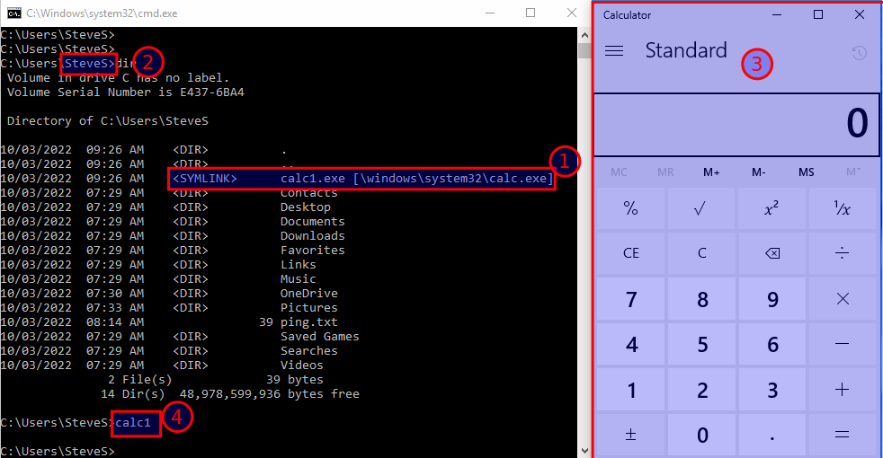
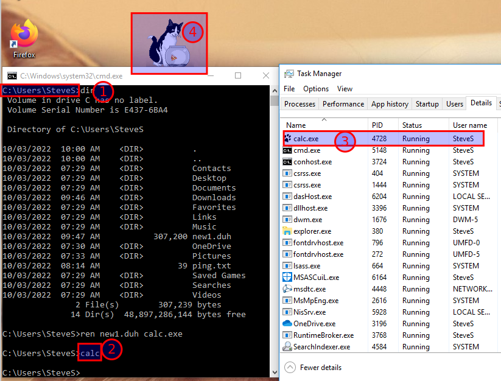

# Symbolic Link

**This activity will create batch files and symbolic links**

Launch VMware Workstation and select the Windows 10 VM tab.

Open activity 3 snapshot

Log in as **User** with password **Windows1**.

**Symbolic Link**

Create a symbolic link to open the Windows **Calculator** accessory program (calc.exe).

Note - Only the *Administrator* can create a symbolic link

Open a **Command Prompt (Admin)**

Change the prompt to your user home directory. Enter

cd \Users\yourname

mklink calc1.exe \windows\system32\calc.exe

Close Admin command window

Sign out as **User** and log in as your **username** account

To open a command prompt, enter

**Start – Run – cmd - OK**

Prove the file calc1.exe is in your home directory as a symbolic link.

Enter

**dir**

Open the calculator program with the symbolic link. Enter

**calc1.exe**

## **Screenshot 1 showing the command prompt window and the calculator program running.**

Close the calculator program

***The symbolic link can be used rather than specifying a long path name to the directory that contains the program or altering the system PATH***

Delete calc1.exe. Enter

**del calc1.exe**

Sign out as your username and log in as **User**

Open a **Command Prompt (Admin)**

From the prompt **\Windows\System32** create a new subdirectory tree for the lab files

**md \LabFiles\act5**

Change to the new subdirectory

**cd \LabFiles\act5**

Create a symbolic link to run the Felix program

**mklink new1.duh \LabFiles\felix.exe**

Run the Felix program. Enter

**new1.duh**

FELIX WILL BE STARTED

Open Task Manager and view the running programs

**Close Felix**

Prove the symbolic link will work to run the Felix program from another location

Copy **new1.duh** to your user home directory. From the **\LabFiles\act5** prompt, enter

**copy new1.duh \users\yourname**

Sign out as **User** and log in as your **username** account

Open a command prompt and enter **dir** to verify the link **new1.duh** has been copied

**Note that the file new1.duh is not listed as a symbolic link in your user home directory**

Rename new1.duh as calc.exe. Enter

**ren new1.duh calc.exe**

Run Felix from the renamed symbolic link calc.exe. Enter

**calc.exe**

Open Task Manager and view the running programs

Note that Task Manager shows calc.exe is running, not felix.exe.

calc.exe is a legitimate Windows accessory program.

The Felix icon is displayed beside the name calc.exe

Malware could be running disguised as a legitimate system program

## **Screenshot 2 of Task Manager, the command window and Felix.**

**Close calc.exe**

Sign out as your username and log in as **User**

---
[Prev](01_evaluation.md) | [Home](README.md) | [Next](03_hard-link.md)
