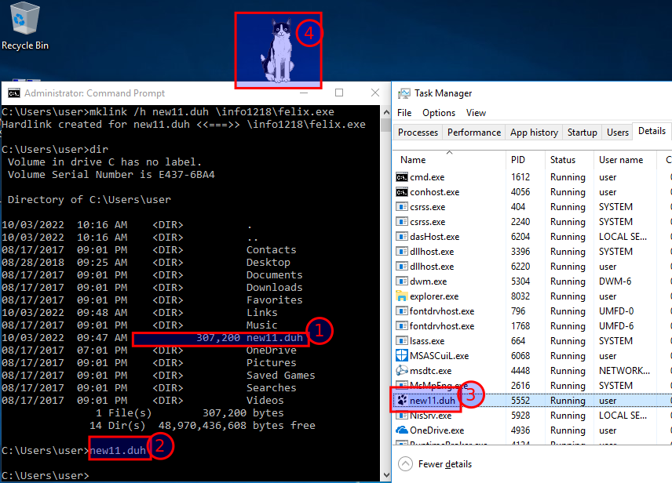

# Hard Link

**Create Hard Link**

Create a hard link to the Felix program. Open a **Command Prompt (Admin)**

Change to the **User** (`C:\Users\user`) home directory. Enter

**cd \Users\user**

**mklink /h new11.duh \LabFiles\felix.exe**

Enter **dir** to view the new file listed. Note that **new11.duh** is not listed as a symbolic link

Run the Felix program via the hard link. Enter

**new11.duh**

Open Task Manager and view the running programs

Note that the program listed is **new11.duh** and not Felix

## **Screenshot 3 of Task Manager, the command window and Felix.**

**Close new11.duh**

---
[Prev](02_symbolic-link.md) | [Home](README.md) | [Next](04_directory-linking.md)
