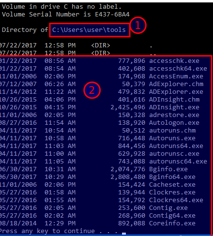

# Directory linking

**Directory linking**

In the **User** home directory create a directory link to the *sysinternals* directory

**mklink /d tools \LabFiles\sysinternals**

Enter **dir** to view the link created. The file system will now show a link (`tools`) to the *sysinternals* directory.

Enter **dir /p tools** to see the list of files associated with the tools symbolic link

Close the command Prompt (Admin) window

Open a Command Prompt window

Change to the tools directory and view the files

cd tools

dir /p

The files listed are the same as the *\LabFiles\sysinternals* directory

## **Screenshot 4 of the first page output**

Sign out as **User** and sign in as your **username** account

---
[Prev](03_hard-link.md) | [Home](README.md) | [Next](05_for-loops-amp-variables.md)
