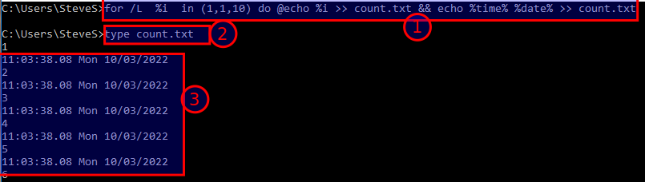
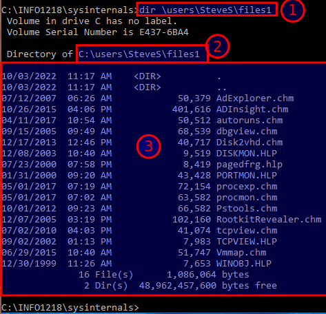

# For loops & variables

**Working with variables in FOR DO commands**

The following command will count from 1 to 10. Enter

**for /L %i in (1,1,10) do echo %i**

Note the screen display shows the echo command counting up from 1 to 10

The following command will count from 1 to 10 and place the output into a text file along with the date and time. Enter

**for /L %i in (1,1,10) do echo %i >  count.txt &&  echo %time%  %date%  >>  count.txt**

View the contents of **count.txt**

**type count.txt**

Note the content shows the last number entered 10 along with the date and time

With the redirect command the destination file entry was overwritten with each command iteration but the date and time were **appended** to the end of the file

To stop each command iteration from being displayed on the screen use the @ symbol in front of the echo command. Use the up arrow to retrieve and edit the long command string

**cls** to clear the screen first

**for /L  %i  in (1,1,10) do @echo %i >> count.txt && echo %time% %date% >> count.txt**

View the contents of **count.txt**

**type count.txt**

## **Screenshot 5 of the output from the command.**

Copy selected files from the sysinternals subdirectory to your username home directory

In the \Users\yourname directory create subdirectories with names files1 & files2

   md files1

   md files2

Change the prompt to the sysinternals subdirectory

    **cd \LabFiles\sysinternals**

Enter the following command to search for all files with a .hlp and .chm extension in the current sysinternals directory and copy those files to the destination files1 subdirectory

**for %i in (*.hlp *.chm) do copy %i \Users\yourname\files1**

The screen will show a message for each file copied

View files in \Users\yourname\files1

    **dir \Users\yourname\files1**

> [!WARNING]
> TODO: Retake this screenshot. The current image still shows a legacy course-specific folder path from the original source.

## **Screenshot 6 of the files1 directory content**

---
[Prev](04_directory-linking.md) | [Home](README.md) | [Next](06_batch-files.md)
