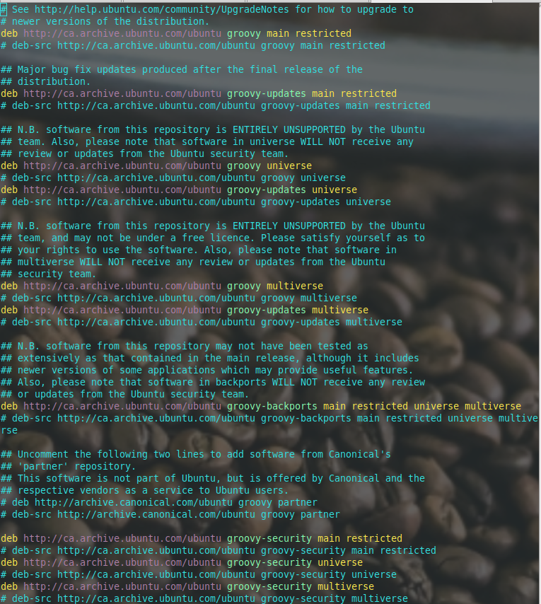
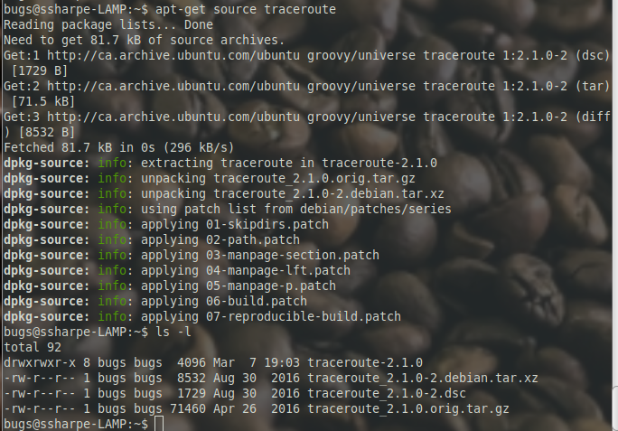

# Get the Source Code

## Objectives

- Get the source code for `traceroute`
- Change the text of the version output
- Use `make` to build the `traceroute` utility
- Test the changed binary
- Install the utility
- Test the installed binary from another directory


*Just another day at the office.*

## Prepare the APT source repositories

For Ubuntu, getting source code for a package is straightforward once the source repositories are enabled. The source material notes that the same basic workflow is also useful for later kernel-source labs.

Before using the simple `apt-get source` workflow, review `/etc/apt/sources.list` and make sure the `deb-src` lines are enabled. In the Ubuntu example below, the `#` in front of each `deb-src` line means the source repositories are still commented out.



To fix that in `vi`, run:

```vim
:%s/^# deb-src/deb-src/g
```

This means:

- `%` = the whole file
- `s` = substitute
- `^# deb-src` = lines that start with `# deb-src`
- `deb-src` = the replacement text
- `g` = replace every match on the line

The updated screenshot below shows the source repositories uncommented after that multi-line substitution:


> [!NOTE]
> The original lab now notes that on Debian the source repositories may already be enabled, so you may not need to uncomment anything.

Use the following workflow:

```bash
sudo -i
vi /etc/apt/sources.list
```

Inside `vi`, run:

```vim
:%s/^# deb-src/deb-src/g
:wq
```

Then continue in the shell:

```bash
apt-get update
apt-get install dpkg-source-gitarchive
exit
cd ~
apt-get source traceroute
```

When `apt-get source traceroute` finishes, you should have a new `traceroute-2.1.0` directory along with the `.dsc`, `.orig.tar.gz`, and Debian packaging files in your home directory.

## Screenshot 1

Screen print the output from getting the `traceroute` source into your home directory.



---
[Home](README.md) | [Next](02_source-tree-and-build-basics.md)
