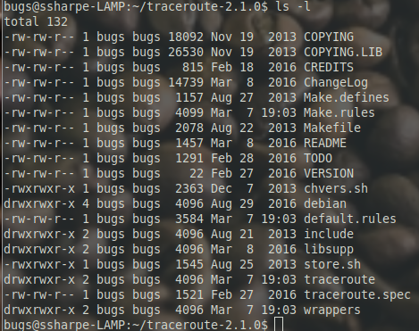
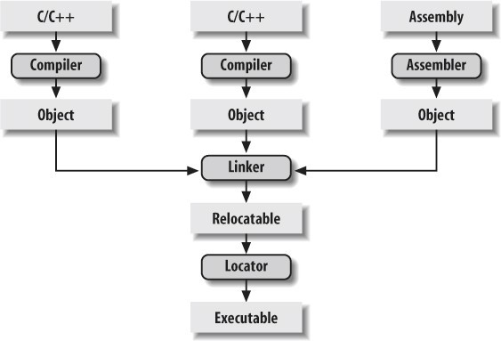

# Source Tree and Build Basics

After extracting the package, enter the new source directory and list its contents:

```bash
cd ~/traceroute-2.1.0
ls -la
```

At this point you should see several files and directories, including:

- `Makefile`
- `Make.rules`
- `Make.defines`
- the `traceroute/` source directory



The `Make*` files define how the program is compiled, linked, cleaned, and installed.

- The compiler stage turns `.c` source into object files.
- The linker stage combines object files into an executable.
- This project builds the `libsupp.a` helper library as part of the process, and then links the final `traceroute` executable.



---
[Prev](01_get-the-source-code.md) | [Home](README.md) | [Next](03_edit-the-source-code.md)
