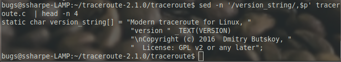
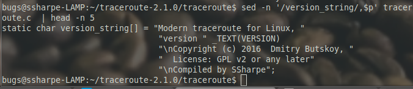

# Edit the Source Code

The `traceroute` program is written in C, so the source tree contains both:

- `.c` source files
- `.h` header files

This lab is not meant to be a programming exercise. The goal is to make a safe, visible change to an output string so you can see the full source-edit, build, and install workflow.

Change into the source directory and locate the `version_string` block in `traceroute.c`:

```bash
cd ~/traceroute-2.1.0/traceroute
vi traceroute.c
```

Find the string `version_string` and add a new line before the closing semicolon so it reads:

```c
"\n Compiled by YourInitialLastName";
```

Replace `YourInitialLastName` with your own first initial plus last name.

The original source screenshots show the section before and after the edit:



> [!WARNING]
> TODO: Retake this screenshot. The current image still shows the original `SSharpe` value from the source material.

## Screenshot 2

Screen print the file after you make the change.



---
[Prev](02_source-tree-and-build-basics.md) | [Home](README.md) | [Next](04_build-the-program.md)
