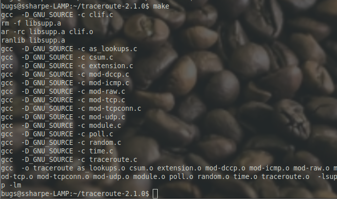

# Build the Program

After saving the source file, return to the parent directory that contains the `Makefile`:

```bash
cd ~/traceroute-2.1.0
make clean
make
```

If you get a compile error, fix the source change and rerun the commands.

The `make clean` step removes generated files so the project can be rebuilt from a clean state. The `make` step compiles and links the program.

## Screenshot 3

Show a screen print of a successful `make`.



---
[Prev](03_edit-the-source-code.md) | [Home](README.md) | [Next](05_test-and-install.md)
