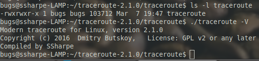
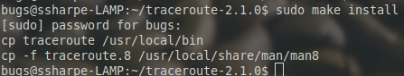

# Test and Install

## Test the built program from the build tree

The compiled program is in the `traceroute/` subdirectory. Run it directly from there to confirm that your version-string change is visible:

```bash
cd ~/traceroute-2.1.0/traceroute
./traceroute -V
```

## Screenshot 4

Screen print your test showing your custom name in the version output.

> [!WARNING]
> TODO: Retake this screenshot. The current image still shows the original `SSharpe` value from the source material.



## Install the program into production

To install the newly built binary so it can be run from anywhere on the system:

```bash
cd ~/traceroute-2.1.0
sudo make install
```

## Screenshot 5

Clear your screen and screen print the successful result of `sudo make install`.



---
[Prev](04_build-the-program.md) | [Home](README.md) | [Next](06_test-in-production.md)
