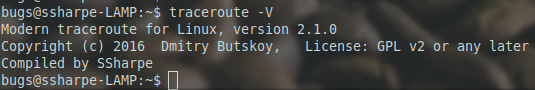

# Test in Production

Change back to your home directory before testing again. That ensures you are not accidentally running the binary from the build tree.

```bash
cd ~
traceroute -V
```

## Screenshot 6

Show the output of `traceroute -V` from production. Make sure the screenshot shows the directory you ran it from and the command you issued.



---
[Prev](05_test-and-install.md) | [Home](README.md) | [Next](07_traceroute-exercises.md)
