# Downloading Debian

Linux is distributed in many ways:

1. Full ISO images that include most packages and are usually several gigabytes in size.
2. Net install images, which include just enough to start the installation and then pull the rest from the internet.
3. Prebuilt images such as Docker containers or ready-made virtual machines.

This lab uses option 2: a Debian net install ISO.

[Installing Debian via the Internet](https://www.debian.org/distrib/netinst#smallcd)

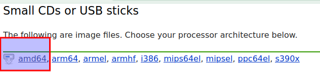

Follow the link above, select **AMD64**, and download the Debian netinst ISO.

> [!NOTE]
> The original source material used **debian-11.3.0-amd64-netinst.iso**. If the current Debian release is newer, that is fine.

## Configuring Virtual Machine

Configuring Virtual Machine hardware

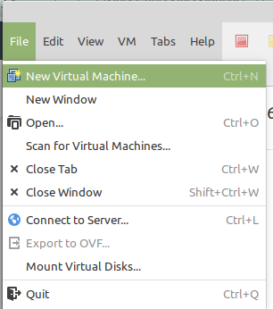

Create a new VM

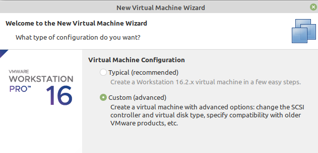

Create a new VM

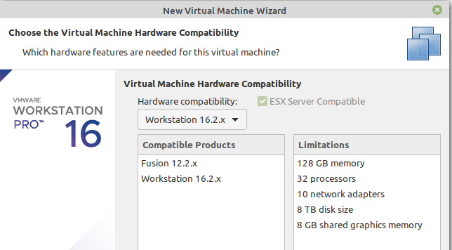

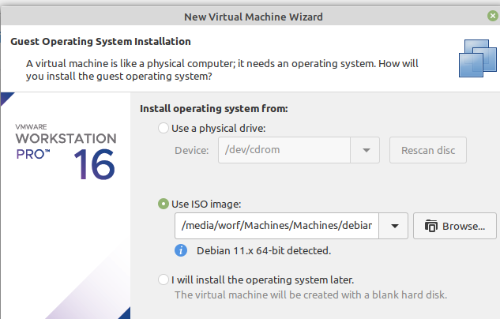

Select the installer ISO and let VMware detect the Debian version automatically.

> [!NOTE]
> It is usually best to choose the option to install the operating system later, because VMware may otherwise try to perform an unattended install.

Create a new VM

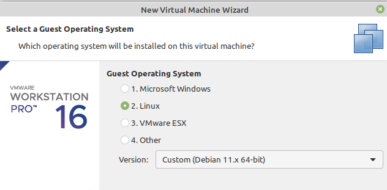

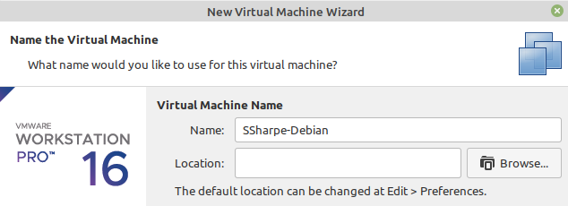

Name the machine **before** selecting a location on your hard drive.

Use **first initial + last name + `-Debian`** for the VM name. In the example screenshots, Steve Sharpe becomes **SSharpe-Debian**.

Create a new VM

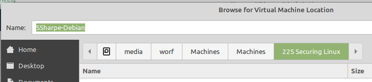

Store the VM in the directory where you keep your virtual machines. Create a clearly named subfolder so the Debian VM stays organized.

> [!WARNING]
> Several screenshots in this section still show the old folder name **22S Securing Linux** from the original source material. Treat that as a legacy example only and use your own organized folder name instead.

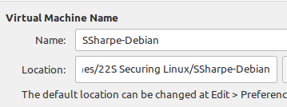

Create a new VM

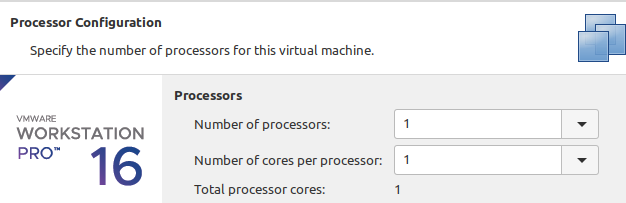

Leave the VM configured with a single CPU and a single core.

Later labs can add more cores hot while the **VM is running**.

Create a new VM

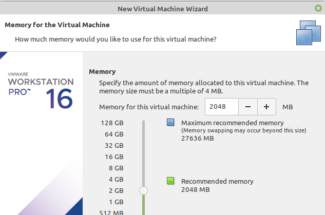

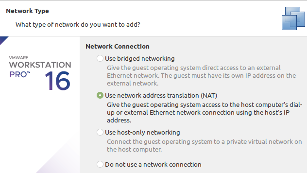

Create a new VM

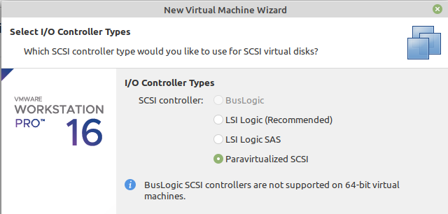

Paravirtual drivers are part of the kernel now, which take much less CPU cycles when being used.

Create a new VM

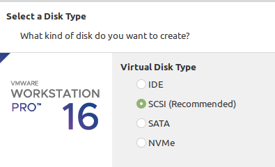

Just like paravirtualized drivers, NVMe is faster and takes less CPU. However, select SCSI because we will be working with disks and for the first few weeks we need the disks to be called something simple like `sda`, `sdb`, and so on. Feel free to reinstall with NVMe once you are confident in what you are doing.

Create a new VM

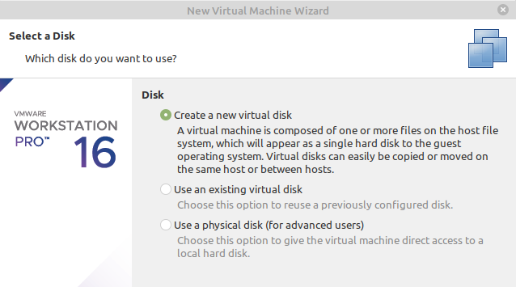

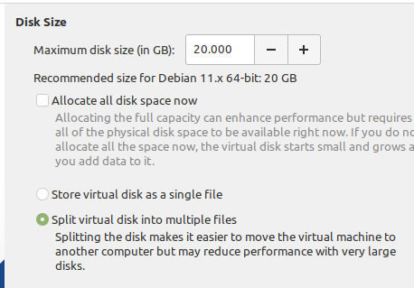

Split the virtual disk into multiple files for two practical reasons:

1. On a spinning disk, smaller files are easier for the host OS to defragment than one huge monolithic file.
2. If you back up to older FAT32 media, you are less likely to hit the maximum file size limit.

Create a new VM

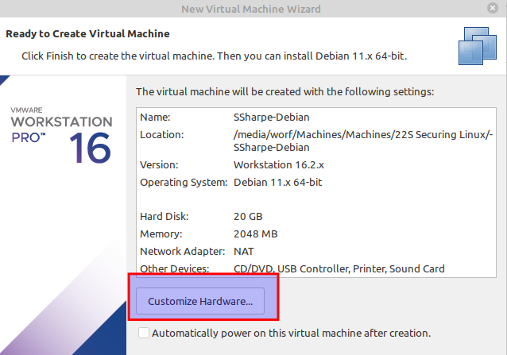

Click **Customize Hardware**.

Create a new VM

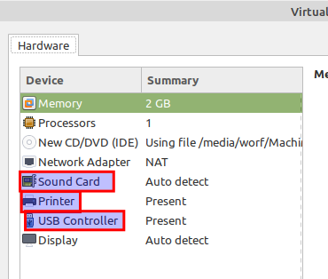

Remove: Sound Card, Printer and USB Controller

Create a new VM

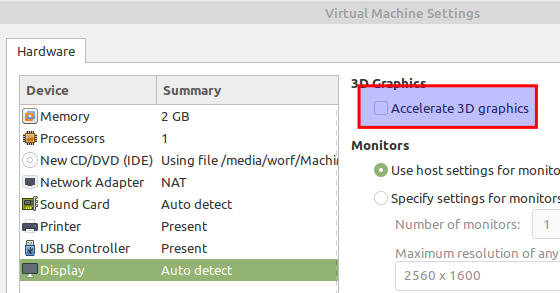

Confirm Accelerate 3D graphics is **unchecked**

Confirm VM configuration

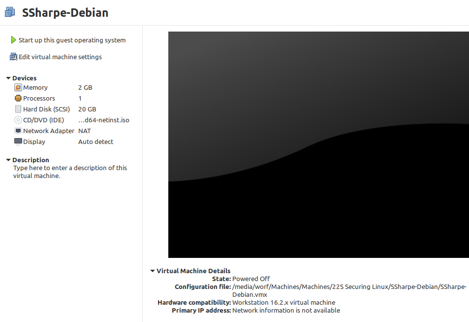

Only the listed hardware should be present. Nothing else.

Get organized!

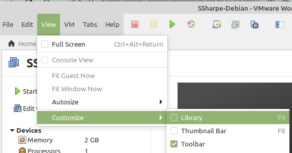

Display the VM Library by going to View > Customize > Library

Get organized!

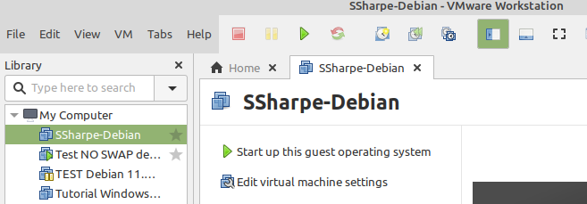

You should now see your VM on the left. In the example screenshots, that VM is named **SSharpe-Debian**.

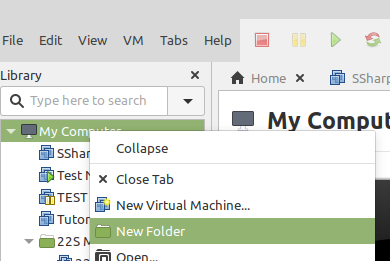

Right-click **My Computer** and select **New Folder**.

Create a folder name that keeps your virtual machines organized. The screenshots still show the legacy example **22S Securing Linux**, but you should use a folder name that makes sense for your own setup.

Get organized!

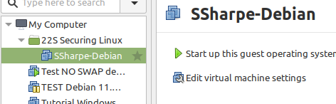

Drag your new VM into the folder you just created. Any new VMs you use for this course can be stored in the same location to keep everything organized.

## Screenshot 1

Your completed hardware profile. Make sure you have configured everything shown in the steps above.

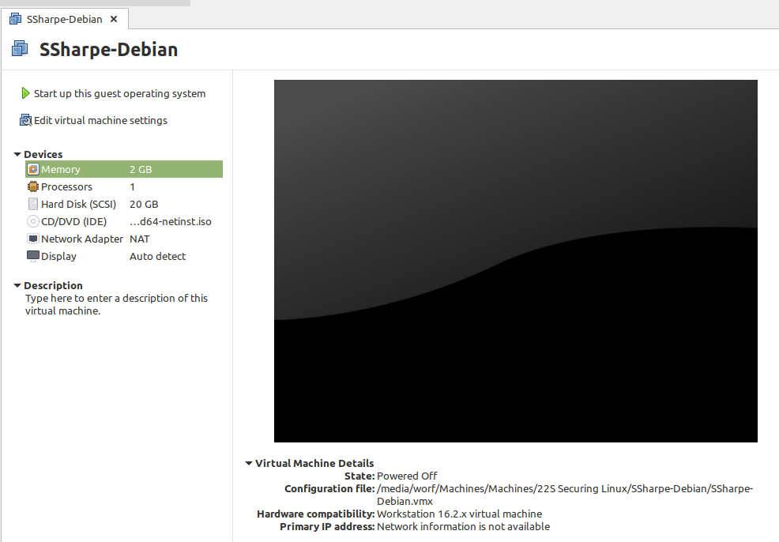

---
[Prev](01_evaluation.md) | [Home](README.md) | [Next](03_starting-debian-installer.md)
