# Starting Debian installer

With the hardware profile configured, power on the virtual machine.

Starting Debian installer

Start the virtual machine. Select **Install** and **do not** choose **Graphical Install**.

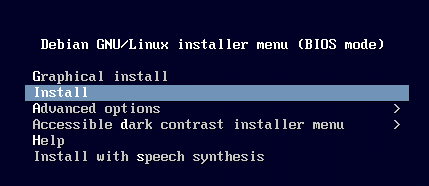

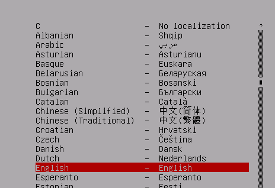

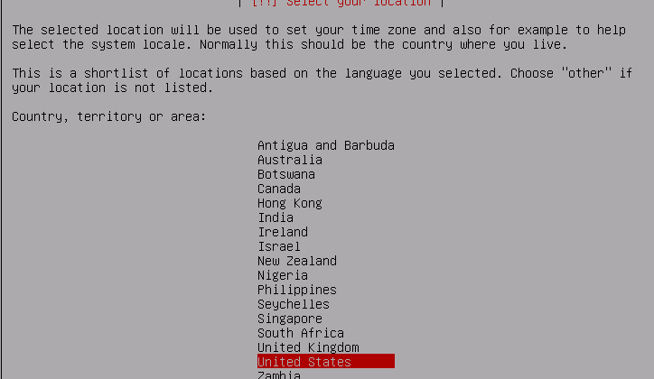

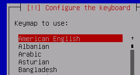

Accept the defaults on these three screens.

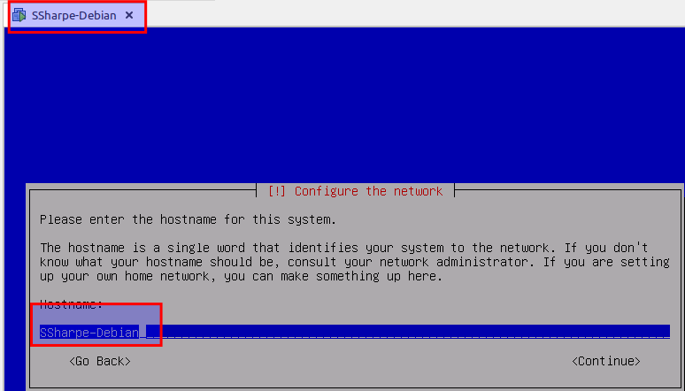

Name the system the same way you named the VM in the previous step.

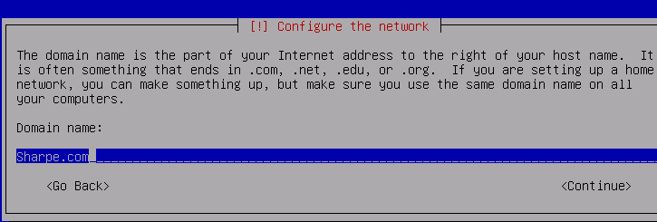

Set the domain name to **your last name dot com**. In the example screenshot, that becomes **Sharpe.com**.

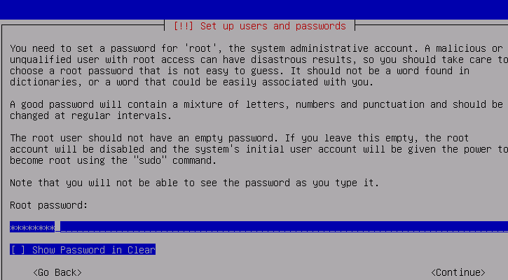

A few notes here:

1. If you set a root password here, `sudo` will **not** be configured automatically.
2. In a later exercise, you will practice disabling the root account and installing `sudo`.

For this lab, have another person set the root password so you do not know it.

Create your regular user account.

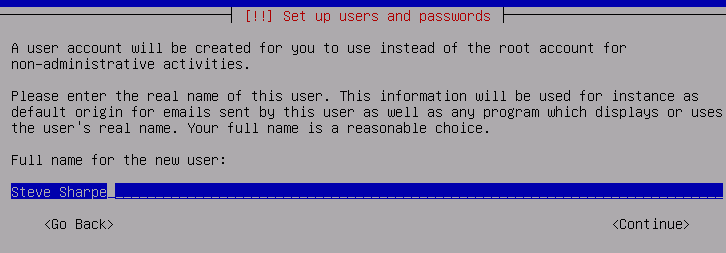

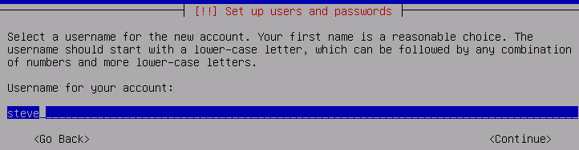

Use your first name for the user.

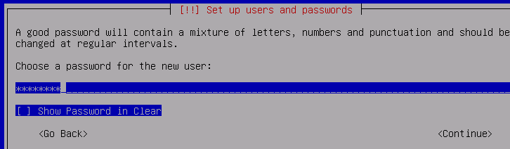

Have that same person set this password as well. **You should not know either password yet.**

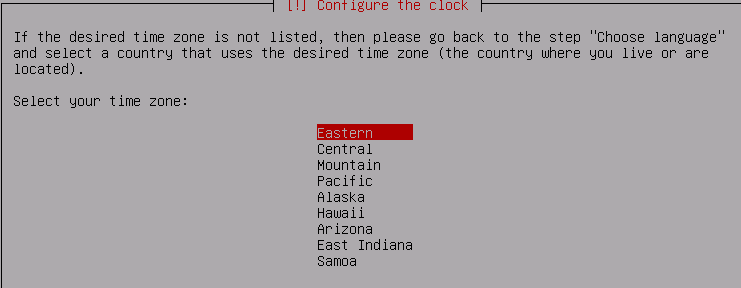

The original source material assumes the Eastern time zone. If you are elsewhere, select the time zone that matches your location.

---
[Prev](02_downloading-debian.md) | [Home](README.md) | [Next](04_partition-disk-and-configure-lvm.md)
