# Partition disk and configure LVM

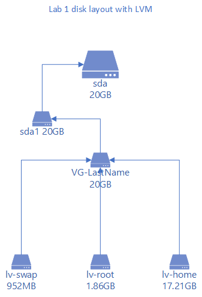

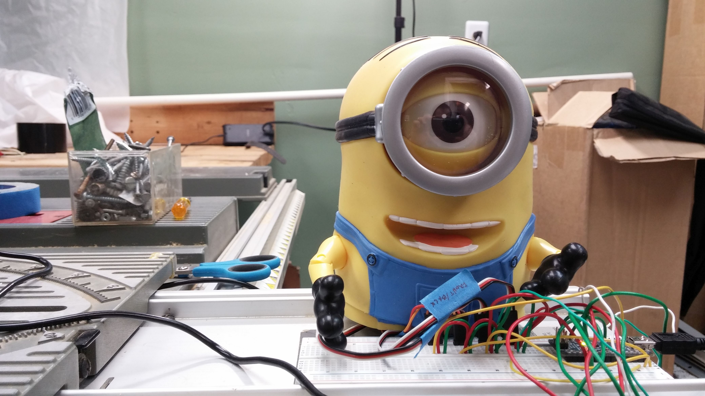

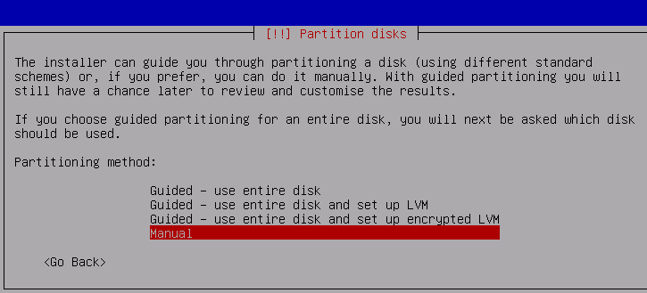

Select manual

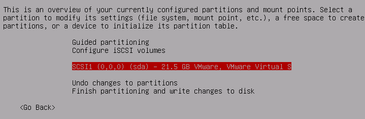

Select **sda** as shown.

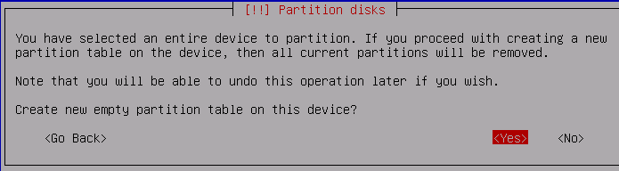

Select **Yes**.

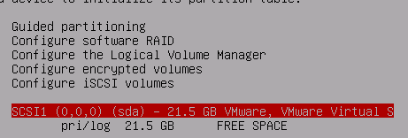

You should now have a partition with 21.5 GB of **free space**.

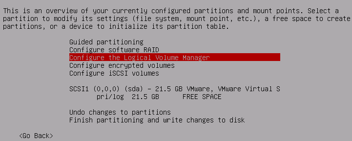

Select **Configure the Logical Volume Manager**

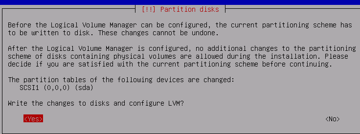

Answer **Yes**.

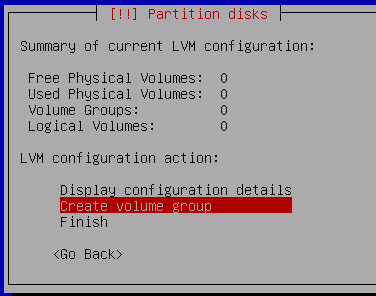

Select **Create volume group**

Name the volume group **VG-LastName**. In the example screenshots, that becomes **VG-Sharpe**.

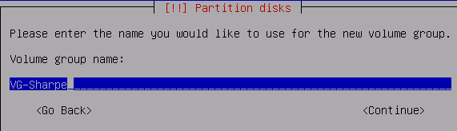

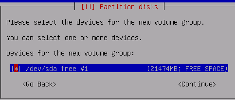

Use `Tab` to move around and `Space` to select. Make sure you select the one drive available: `/dev/sda`.

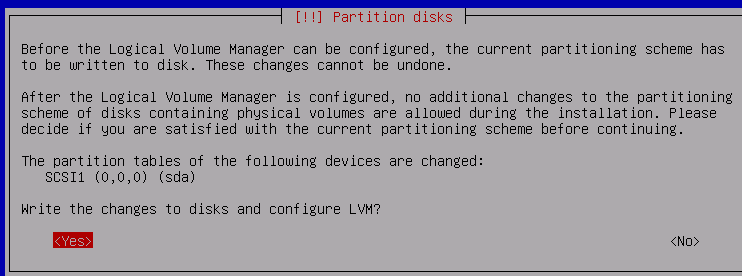

Select **Yes**.

Even though you started from `/dev/sda`, the installer creates a partition first, so the resulting volume group lives on `/dev/sda1`.

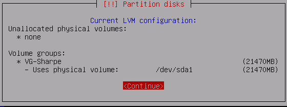

To confirm, select **Display configuration details** from the main LVM configuration page.

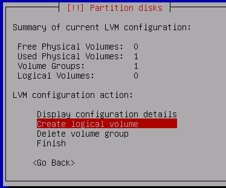

Select **Create logical volume**

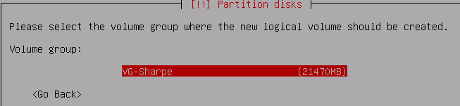

For the next three logical volumes, keep selecting the same volume group: **VG-LastName**.

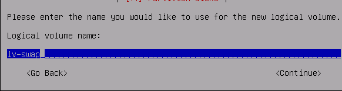

Create `lv-swap` with a size of **1G**.

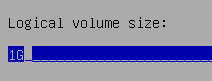

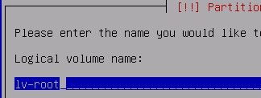

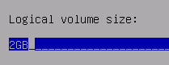

Let `lv-root` be **2 GB**.

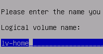

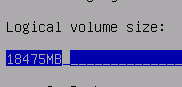

Let `lv-home` use the remaining free space in **VG-LastName**.

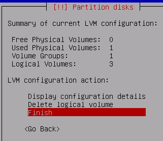

Select **Finish**.

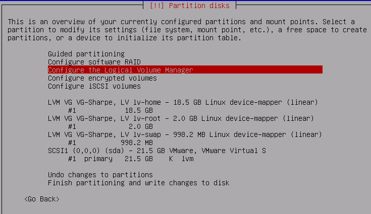

Your summary should look like this.

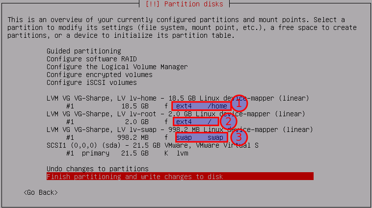

Set the filesystem types and mount points for **#1** and **#2**. Set **#3** as swap.

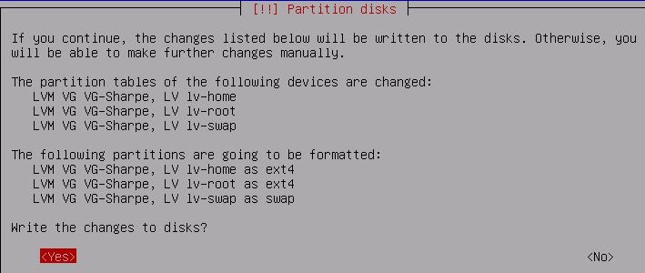

## Screenshot 2

Ask the person who knows the root password to log in as **root** and run:

```bash
lvdisplay | less
```

Capture the details for:

- `lv-swap`
- `lv-home`
- `lv-root`

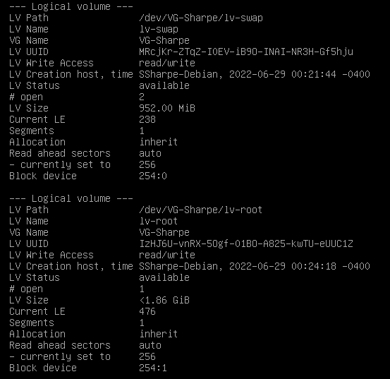

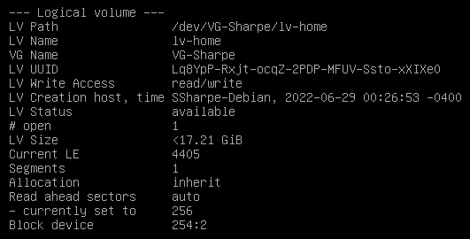

---
[Prev](03_starting-debian-installer.md) | [Home](README.md)
