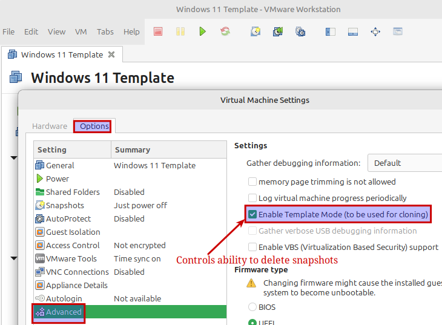
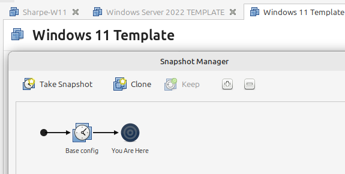
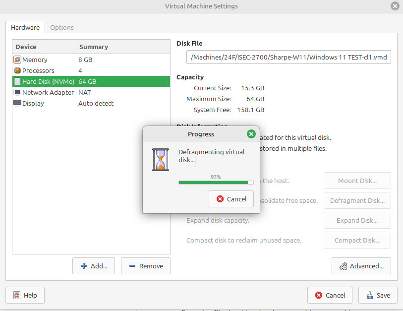

# Template: Clone

## Managing VM Templates in VMware Workstation

Read the template steps carefully before making changes. A mistake here can cost hours of cleanup later.

### Overview

This section explains how to manage template VMs in VMware Workstation. The exact steps depend on whether you are updating an existing template or building one for the first time.

- If the VM is already in template mode, take it out of template mode before making changes.
- If the VM is not in template mode, you can move directly to snapshot cleanup and the rest of the configuration work.
- Apply these steps to both the Windows 11 and Debian templates.

The later steps differ slightly depending on whether you are refreshing an existing template or creating a new one from scratch.

### Preparing the VM Disk

**Finish your configuration work before committing the disk changes**:

Follow the instructions in this guide, such as installing VMware Tools, setting the correct date and time, configuring custom prompts, and installing other software as directed.

Do not delete the existing snapshot yet. Keeping the snapshot available gives you a clean rollback point if you make a mistake during setup.

**Delete Existing Snapshots** (if not in Template Mode):

Once all modifications are completed and you are certain that everything is correct, open the **Snapshots** menu in VMware Workstation and delete any existing snapshots. Deleting the snapshot will fully commit all the changes to the disk.

Be absolutely sure you are ready to commit the changes before deleting the snapshot, because you will no longer be able to revert to the earlier state afterward.

**Defragment the Virtual Disk**:

- In **VMware Workstation**, open **VM > Settings** for the VM.
- On the **Hardware** tab, select **Hard Disk (NVMe)** or the appropriate disk type for that VM.
- Click **Defragment Disk** to optimize the disk layout inside the VM file.

While SSDs usually do not need defragmentation, VMware template disks benefit from it because it helps reduce fragmentation in the virtual disk file before compaction.

**Compact the Virtual Disk**:

- After defragmentation finishes, click **Compact Disk** in the same settings window.
- Compacting reclaims unused space, reduces the VM file size, and makes the template more efficient to clone.

**Why defragment and compact?** Even on SSD-backed storage, these VMware maintenance steps help keep the virtual disk file smaller and cleaner for repeated cloning.

### Handling Snapshots and Template Mode

**If you are modifying an existing template**:

1. **Take the VM out of template mode**:
   In **VMware Workstation**, go to **VM > Manage** and make sure **Template Mode** is unchecked.
2. **Delete the old snapshot**:
   Open the **Snapshots** menu and delete any existing snapshots so you are working from a clean base.
3. **Make the required improvements**:
   Apply the configuration changes and updates from the rest of this guide.
4. **Take a new snapshot**:
   Go to **VM > Snapshot > Take Snapshot** and give it a useful name such as `Base Template`.
5. **Enable template mode again**:
   Return to **VM > Manage** and enable **Template Mode**.

**If this is your first time creating a template**:

1. Complete the configuration work for the VM.
2. Take a snapshot named something like `Base Template`.
3. Enable **Template Mode** under **VM > Manage**.

### Summary

These steps prepare the VM for reliable cloning. Whether you are refreshing an existing template or creating a new one, the goal is the same: a small, clean, repeatable VM that other students can clone without surprises.

---
[Home](README.md) | [Next](02_w11-overview.md)
