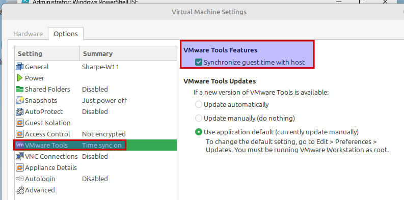

# VMware Tools

## Install VMware Tools and Configure Time Synchronization

1. **Ensure the virtual machine is powered on**.

   The VM must be running before VMware Workstation can mount the VMware Tools installer.

2. **Add the CD/DVD drive if needed**.

   In **VMware Workstation**, open **VM > Settings** and make sure a **CD/DVD drive** exists in the VM hardware list.

3. **Install VMware Tools**.

   In VMware Workstation, choose **VM > Install VMware Tools**.

   If the installer does not start automatically, open **File Explorer** in the guest, browse to the mounted CD-ROM, and launch the installer manually.

4. **Enable time synchronization**.

   Go to **VM > Settings > Options > Advanced** and make sure **Synchronize guest time with host** is enabled.

VMware Tools lets the guest keep its clock aligned with the host. That matters in template VMs because they are often disconnected from the internet and cannot rely on NTP.

5. **Remove the CD/DVD drive**.

   After VMware Tools is installed, remove the temporary CD/DVD drive again so the VM hardware stays minimal.

---
[Prev](02_w11-overview.md) | [Home](README.md) | [Next](04_w11-updates.md)
