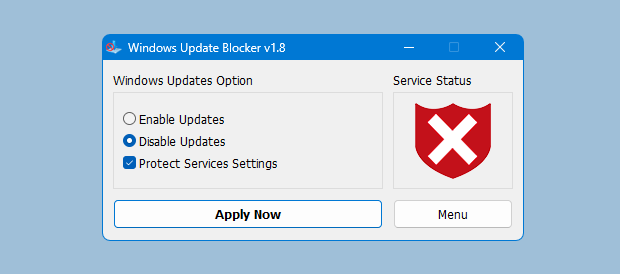
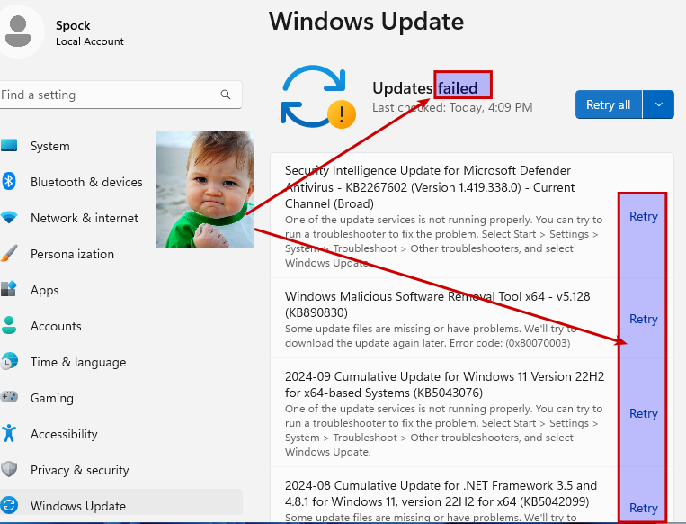

# Windows 11 Updates

## Why Disable Windows Updates on Lab VMs?

- **Performance:** Prevent updates from slowing down the VM during coursework by avoiding background download and installation processes.
- **Network Efficiency:** Reduce bandwidth usage on shared WAN connections by eliminating unnecessary update traffic.
- **Disk Space Management:** Control disk space consumption by stopping the accumulation of update files and related I/O operations, especially on VMs without SSDs.

For these lab templates, the simplest approach is to use **Windows Update Blocker v1.8** rather than manually editing Group Policy, services, and the registry.

### Disable Windows Updates

[Windows Update Blocker](https://www.sordum.org/9470/windows-update-blocker-v1-8/)

1. Download **Windows Update Blocker v1.8**.
2. Run the tool.
3. Choose **Disable Updates**.
4. Make sure **Protect Services Settings** is checked.
5. Apply the changes.

---
[Prev](03_vmware-tools.md) | [Home](README.md) | [Next](05_w11-networking.md)
