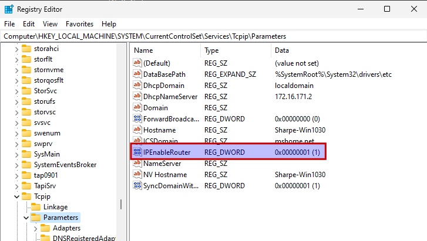

# Windows 11 Networking

## Windows Firewall

For this template, disable Windows Firewall for now. You will turn it back on later when you work specifically on firewall configuration.

In elevated PowerShell, run the following command to **disable** the firewall:

```powershell
Set-NetFirewallProfile -Profile Domain,Public,Private -Enabled False
```

When you want to **re-enable** the firewall later for testing, run:

```powershell
Set-NetFirewallProfile -Profile Domain,Public,Private -Enabled True
```


## Enable IP Routing in the Registry

**Open Registry Editor**:

Press `Win + R`, type `regedit`, and press `Enter`.

**Navigate to the IP Enable Router Key**:

Go to: `HKEY_LOCAL_MACHINE\SYSTEM\CurrentControlSet\Services\Tcpip\Parameters`

**Edit the IP Enable Router Value**:

Look for the entry named `IPEnableRouter`.

- If it doesn’t exist, create it by right-clicking in the right pane, selecting **New > DWORD (32-bit) Value**, and naming it `IPEnableRouter`.

- Set the value to `1` to enable routing (the default value of `0` disables it).

**Restart Your Computer**:

Reboot your machine for the setting to take effect.



> [!WARNING]
> Do **not** enable IP routing on a production Windows machine. You are turning it on here for lab purposes only.

---
[Prev](04_w11-updates.md) | [Home](README.md) | [Next](06_w11-naming.md)
