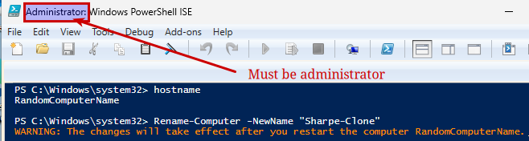
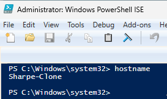
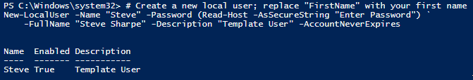
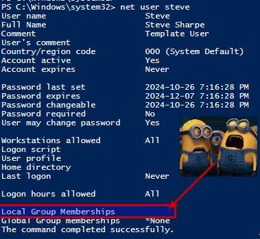
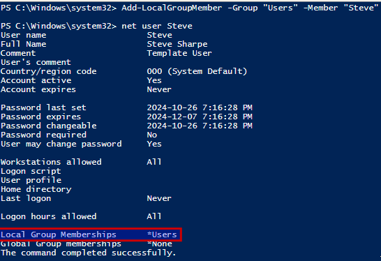
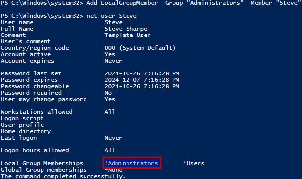
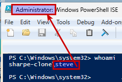

# Windows 11 Naming

## Set and Verify the Computer Name

**Check the current computer name**:

```powershell
hostname
```

This displays the current hostname. Note it to confirm the change afterward.

**Rename the computer** to `LastName-Clone`:

```powershell
Rename-Computer -NewName "LastName-Clone"
```

Use your own last name. For example, if your name is Gordon Stevens, the new computer name would be `Stevens-Clone`.

The screenshots in this section use `Sharpe-Clone` and `Steve` as worked examples. Replace those with your own values when you complete the steps.

**Restart the computer** to apply the name change:

```powershell
Restart-Computer
```



**Verify the computer name after reboot**:

- Open **PowerShell ISE as Administrator** again and run:

```powershell
hostname
```

- Confirm it now displays `LastName-Clone`.



## Create a User, Add to Administrators, and Verify

**Create a new user with your first name**:

```powershell
# Create a new local user. Replace "FirstName" with your first name.
New-LocalUser -Name "FirstName" -Password (Read-Host -AsSecureString "Enter Password") `
-FullName "FirstName" -Description "Template User" -AccountNeverExpires
```



---
### 🧠 Did the new user work?

> [!NOTE]
> **Statement:** Sign out and try logging in as this user. Were you successful?
>
> - [ ] True
> - [ ] False

<details>
<summary>👉 <b>Reveal answer</b></summary>

**Correct:** False

**Feedback:** You really, really sure?
</details>

---

**Verify the user’s initial group memberships**

```powershell
net user FirstName
```



**Add the user to the Users group** (if not already present) and recheck memberships

```powershell
Add-LocalGroupMember -Group "Users" -Member "FirstName"
```



---
### 🧠 Got access?

> [!NOTE]
> **Statement:** Sign out and try logging in as this user. Were you successful?
>
> - [ ] True
> - [ ] False

<details>
<summary>👉 <b>Reveal answer</b></summary>

**Correct:** True

**Feedback:** Yay! Next we'll make the user an Administrator
</details>

---

**Add the user to the Administrators group** and verify:

```powershell
Add-LocalGroupMember -Group "Administrators" -Member "FirstName"
```

Check that `FirstName` is now in both **Users** and **Administrators**.

**Verify the user is now an Administrator**

```powershell
net user FirstName
```





---
### 🧠 Just call me an Administrator

> [!NOTE]
> **Statement:** Were you able to open ISE as an Administrator with your new account?
>
> - [ ] True
> - [ ] False

<details>
<summary>👉 <b>Reveal answer</b></summary>

**Correct:** True

**Feedback:** :-)
</details>

---
[Prev](05_w11-networking.md) | [Home](README.md) | [Next](07_w11-time.md)
