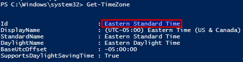
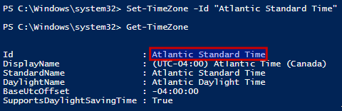
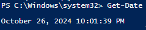

# Windows 11 Time

## Date, Time, and Time Zone Configuration

**Reminder**: Ensure **VMware Tools** is installed on this virtual machine. With VMware Tools, both the **time and time zone** will sync to match the host system’s settings. This ensures accurate timekeeping even if the VM is offline or without an internet connection.

**Verify the current time zone**:

```powershell
Get-TimeZone
```

- This displays the current time zone. If it shows **Eastern Standard Time** or another incorrect zone, proceed to set it to **Atlantic Standard Time**.



**Set the time zone to Atlantic Standard Time** (if needed):

```powershell
Set-TimeZone -Id "Atlantic Standard Time"
```

**Verify the updated time zone**:

- Run the command again:

```powershell
Get-TimeZone
```

- Confirm it now displays **Atlantic Standard Time**.



**Verify the current date and time**:

```powershell
Get-Date
```



Ensure the date, time, and time zone are correct. Atlantic Time will display a **UTC-04:00** offset (during standard time) or **UTC-03:00** (during daylight saving time).

If the time zone is correct but the time is still wrong, return to the VMware Tools section and confirm guest time synchronization is enabled.

---
[Prev](06_w11-naming.md) | [Home](README.md) | [Next](08_w11-prompt.md)
