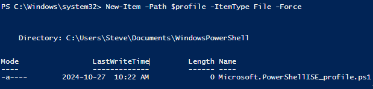
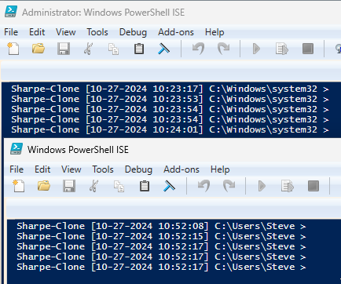

# Windows 11 Prompt

## Persistent PowerShell Prompt Setup and Verification

**Check if the profile file exists**:

```powershell
Test-Path $profile
```

**Create the profile file** (if it doesn't exist):

```powershell
New-Item -Path $profile -ItemType File -Force
```



**Open the profile file in Notepad**:

```powershell
notepad $profile
```

**Add the custom function for the PowerShell prompt**:

Inside the profile file, paste the following function:

```powershell
# Custom PowerShell prompt displaying hostname, date, and time

function prompt {

    $date = Get-Date -Format "MM/dd/yyyy HH:mm:ss"

    $hostname = hostname

    "$hostname [$date] $(Get-Location) > "

}
```

**Save and close the profile file** in Notepad.

**Enable script execution** to allow the custom prompt:

```powershell
Set-ExecutionPolicy -ExecutionPolicy RemoteSigned -Scope CurrentUser
```

**Verify the custom prompt**:

- Restart **PowerShell ISE** and confirm the prompt displays in the format `LastName-Clone [MM/dd/yyyy HH:mm:ss] C:\>`, indicating it’s working as expected.



### Custom PowerShell Prompt Verification

Now that you've set up the custom PowerShell prompt, it's essential to ensure it functions correctly and updates accurately. Please follow these two verification steps:

**Verify the Time and Prompt Update**:

**Check the current time** displayed in the prompt. Every time you press **Enter**, the prompt should update with the current timestamp.

- This indicates that your PowerShell profile is correctly set up to show a dynamic timestamp and current directory.

**Verify Prompt in Administrator and Non-Administrator Modes**:

Open **PowerShell ISE** twice: once as an **Administrator** and once in **non-administrator** mode.

- Confirm that the custom prompt, including the hostname, timestamp, and directory, appears and updates correctly in both modes.

These verifications ensure that your PowerShell customization is applied consistently, regardless of administrative privileges, and that it accurately reflects the current time and directory at each command prompt.

---
[Prev](07_w11-time.md) | [Home](README.md) | [Next](09_w11-openvpn.md)
