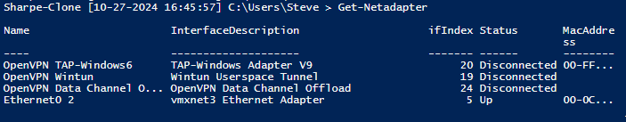
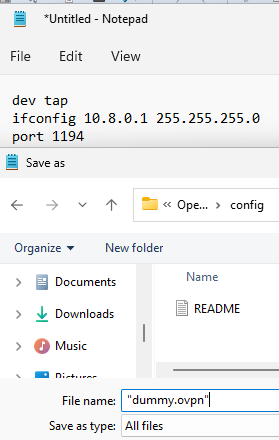
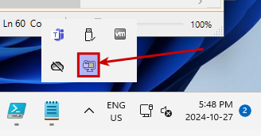
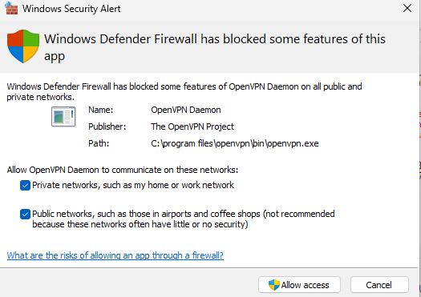
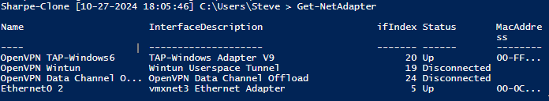
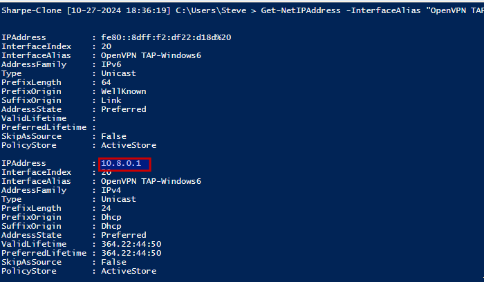

# Windows 11 OpenVPN

## OpenVPN Network Adapter Configuration

In this portion, you'll explore how OpenVPN installs virtual network adapters, examine adapter details with PowerShell, and configure a custom OpenVPN connection to test connectivity.

### Install OpenVPN and Observe Network Adapters

**Install OpenVPN**:

Download and install OpenVPN Community Edition from the official site.

- Once installed, OpenVPN will add virtual network adapters to your system.

**Check Network Adapters**:

Open **PowerShell ISE as Administrator** and run the following command to view all network adapters:

```powershell
Get-NetAdapter
```

You should see a list of network adapters, including **OpenVPN TAP-Windows6**, **Wintun**, and possibly **OpenVPN Data Channel Offload**.

[OpenVPN Community Downloads](https://openvpn.net/community-downloads/)



**Identify Adapters with MAC Addresses**:

- Observe that the **TAP-Windows6** and **Ethernet0** adapters have MAC addresses, while **Wintun** and **Data Channel Offload** adapters do not.

- **Think About Why**:

MAC addresses are typically assigned to physical or Ethernet-like virtual adapters. Adapters without MAC addresses, like **Wintun**, operate at a different layer or use virtual networking that doesn’t require MAC addresses.

**Open Notepad as Administrator**:

- Press **Windows Key + S** to open the search bar.

- Type **Notepad**, right-click on it in the search results, and select **Run as Administrator**.

**Create the Configuration File**:

- In the elevated **Notepad** window, paste the following configuration:

```text
dev tap
ifconfig 10.8.0.1 255.255.255.0
port 1194
```

Save this file as **dummy.ovpn** in the OpenVPN configuration directory (`C:\Program Files\OpenVPN\config`).



**Start OpenVPN with the Custom Configuration**:

- Open the **OpenVPN GUI** and connect using the **dummy.ovpn** configuration file.

- This will activate the **TAP-Windows6** adapter.





**Windows Defender Firewall Alert**:

- When prompted by the **Windows Defender Firewall** alert (see image example), allow OpenVPN to communicate on **both private and public networks** by checking both options and selecting **Allow access**.

- **Note**: This setting is essential as the virtual adapter will be used for local network communication, requiring access through both types of network connections.

### Verify Adapter Connection Status

**Check the Connection Status**:

- Go back to **PowerShell ISE** and run:

```powershell
Get-NetAdapter
```

Confirm that the **TAP-Windows6** adapter now shows **Status: Up**. This indicates that the adapter is active and ready for network communication.



**Verify IP Address Assignment**:

- Check that the **TAP-Windows6** adapter has the IP address **10.8.0.1**, as configured in the custom `dummy.ovpn` file.

- To verify, run:

```powershell
Get-NetIPAddress -InterfaceAlias "OpenVPN TAP-Windows6"
```

Confirm that the IP address **10.8.0.1** is assigned to the adapter.



**Note**: When checking the IP address, using the full command `Get-NetIPAddress -InterfaceAlias "OpenVPN TAP-Windows6"` specifically targets the TAP adapter, showing only its IP address information. If you simply run `Get-NetIPAddress`, it will display the IP information for **all network adapters** on the system, resulting in several pages of output that include adapters we’re not currently interested in. Filtering by `-InterfaceAlias` helps you focus on just the OpenVPN TAP adapter.

### Test Network Connectivity

**Ping the TAP Interface**:

- Test connectivity by pinging the TAP interface:

```powershell
ping 10.8.0.1
```

You should receive replies, indicating a successful connection to the TAP adapter.

**Use `Test-Connection` for Additional Details**:

- In PowerShell, you can also use `Test-Connection`, which provides more detailed information about each packet sent:

```powershell
Test-Connection -ComputerName 10.8.0.1
```

**Summary of Differences**

**PowerShell Integration and Object Output**:

Unlike `ping`, which provides plain text output, `Test-Connection` returns structured objects that PowerShell can manipulate. This makes it easier to filter, format, and pass results to other cmdlets, providing more flexibility in how you use the data.

**Scripting and Automation**:

`Test-Connection` is designed for PowerShell, allowing seamless integration in scripts. You can use parameters like `-AsJob` to run multiple tests simultaneously or `-Count` to control the number of attempts, making it ideal for automating network checks across multiple systems.

---
[Prev](08_w11-prompt.md) | [Home](README.md) | [Next](10_w11-openssh-server.md)
