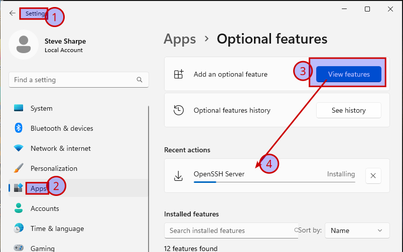
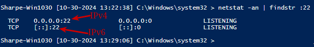

# Windows 11 OpenSSH Server

## Instructions for Installing OpenSSH Server

### GUI Instructions for Installing OpenSSH Server

**If you have Windows Updates blocked**:

- Open **Windows Update Blocker v1.8** and temporarily enable Windows Updates.

- Restart your computer to allow updates to take effect.



**Then, install OpenSSH Server**:

Open **Settings** and navigate to **Apps > Optional features**.

Scroll down to see if **OpenSSH Server** is listed under “Installed features.” If it’s not:

Click **View Features** at the top.

- Search for "OpenSSH Server" and select it, then click **Install**.

**After installation**, disable updates again using **Windows Update Blocker**.

### Configure the SSH Server Service to Start Automatically and Start It (PowerShell)

Run the following PowerShell commands to configure and start the SSH service:

**Set the SSH service to start automatically**:

```powershell
Set-Service -Name sshd -StartupType Automatic
```

**Start the SSH service**:

```powershell
Start-Service -Name sshd
```

To verify that SSH is running and listening on port 22:

- Open Command Prompt or PowerShell and type:

```powershell
netstat -an | findstr :22
```



---
[Prev](09_w11-openvpn.md) | [Home](README.md) | [Next](11_w11-software.md)
