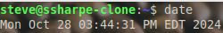
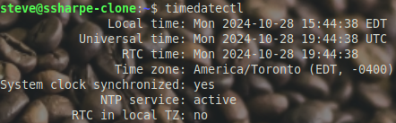
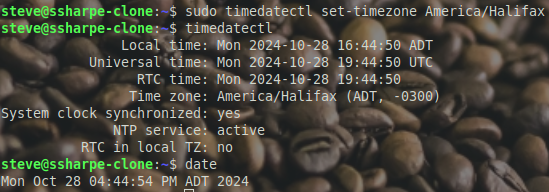

# Debian Time

## Date and Time Configuration Guide

**Enable Time Sync with Host:**

Go back to the VMware Tools section and make sure **Synchronize guest time with host** is enabled. This keeps the Debian VM aligned with the host system.

**Verify Current System Time and Time Zone:**

Check the current date and time on your system by running:

```bash
date
```



Confirm the current time zone with:

```bash
timedatectl
```



Look for `Time zone:` in the output to confirm if it's set correctly.

**Set Atlantic Time Zone (for Sydney, Nova Scotia):**

To adjust the time zone to Atlantic Standard Time, run:

```bash
sudo timedatectl set-timezone America/Halifax
```



**If Time Is Incorrect Despite the Correct Time Zone:**

**Do not manually set the time** unless absolutely necessary.

- Instead, ensure **VMware Tools** is set to sync with the host’s clock, especially since this VM may often lose internet access and can’t rely on Network Time Protocol (NTP).

- Confirm that the **host system’s date and time** are correct, as the VM will depend on this sync to stay accurate when offline.

**Confirm Settings:**

Run `timedatectl` again to verify that both the time and time zone are correct after adjustments.

---
[Prev](13_debian-naming.md) | [Home](README.md) | [Next](15_debian-prompt.md)
