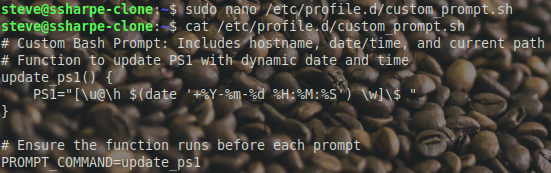
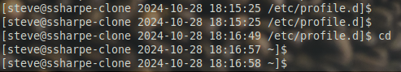

# Debian Prompt

## Global Prompt Configuration

**Create a Global Prompt Configuration Script**:

Create the script:

```bash
sudo nano /etc/profile.d/custom_prompt.sh
```

Paste the following contents into the file:

```bash
# Custom Bash prompt: includes hostname, date/time, and current path
update_ps1() {
    PS1="[\u@\h $(date '+%Y-%m-%d %H:%M:%S') \w]\$ "
}

# Ensure the function runs before each prompt
PROMPT_COMMAND=update_ps1
```



This script modifies the prompt to include the hostname, date/time, and current path so the template behaves consistently in every shell session.

Verify the file permissions with:

```bash
ls -l /etc/profile.d/custom_prompt.sh
```

You should see output similar to:

```text
-rw-r--r-- 1 root root 264 Oct 28 18:03 custom_prompt.sh
```

No executable bit is required because the file is sourced, not run directly.

**Logout and Verify Prompt**:

After creating and saving the script, log out of your current session and log back in.

Your prompt should now look similar to the example below:



This confirms that the hostname, date/time, and current working directory are being displayed correctly.

---
[Prev](14_debian-time.md) | [Home](README.md)
