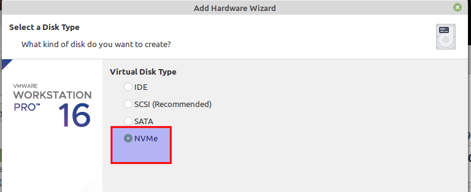
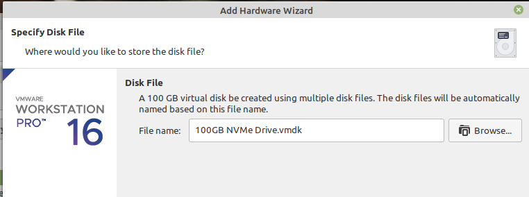
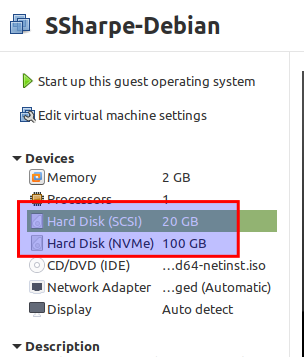

# Moving Extents

This server has been running for two years on an old 20 GB SATA drive. It is time to migrate the data to a new 100 GB NVMe drive. The long-term plan may be RAID, but today the goal is simply to get all data off the old drive and onto the new one.

Company policy says machines must be powered off before service work. Shut the VM down with `sudo poweroff`.

Using VMware Workstation, add a 100 GB NVMe drive to the VM.







Once the new NVMe drive is installed, boot the VM again.

When you run `lsblk`, the physical volume `nvme0n1` should appear.


Before LVM can use the new drive, create a partition on it with `sudo fdisk /dev/nvme0n1`.


Enter `p` to verify that there are no partitions yet.


Enter `F` to verify the free space available for partitioning. It should be about 100G.


Press `n` to create a new partition, then choose `p` for primary and `1` for partition 1.

For the highlighted entries, press Enter to accept the defaults.


Enter `p` again to verify the new partition. If everything looks correct, press `w` to write the partition table.


Create a physical volume on the new partition:

```bash
sudo pvcreate /dev/nvme0n1p1
```


## Working with the Volume Group

So far you have done the physical work: adding the disk and partitioning it. Now we extend the existing volume group to include the new drive. Substitute your own volume-group name if it differs from the screenshot example.

Start by running:

```bash
sudo vgextend VG-Sharpe /dev/nvme0n1p1
```


At this point, the new free space is part of the volume group, but the existing data still lives on the old SATA-backed physical volume. Because both drives now belong to the same volume group, we can migrate the extents off `/dev/sda1`.

Run:

```bash
sudo pvmove -i2 /dev/sda1 /dev/nvme0n1p1
```

The `-i2` reporting interval prints progress every two seconds.


Once the move is complete, remove `/dev/sda1` from the volume group:

```bash
sudo vgreduce VG-Sharpe /dev/sda1
```


## Screenshot 3

Capture the `pvdisplay` output and highlight it exactly as shown so it is clear that the new NVMe drive belongs to the volume group and the old `sda1` drive no longer does.

---
[Prev](03_shuffling-space.md) | [Home](README.md) | [Next](05_removing-old-drive.md)
