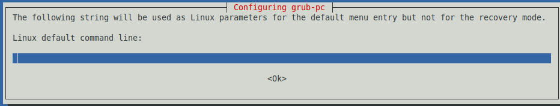
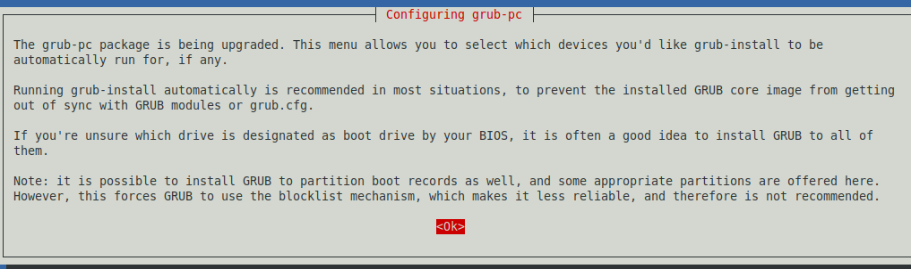
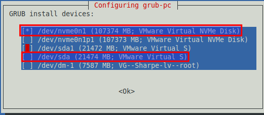
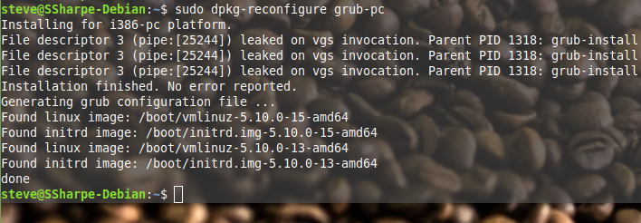
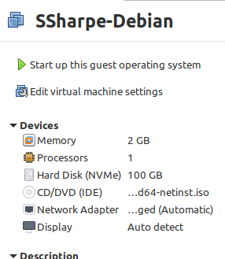
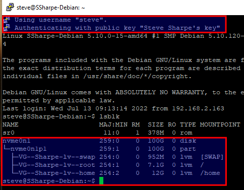

# Removing Old Drive

> [!WARNING]
> Fully back up your virtual machine by copying the VM directory to external storage and testing that backup. By continuing, you accept that a mistake here could require rebuilding the VM from an earlier lab.

Now that the data has been moved off the old drive, we want to remove it. If you remove it immediately, the VM will not boot, because the GRUB bootloader still resides on the original `sda` disk.

We need to write a new GRUB bootloader to `nvme0n1`, not to `nvme0n1p1`.

Run:

```bash
sudo dpkg-reconfigure grub-pc
```


Leave the Linux command line blank and press Enter.



Leave the default Linux command line blank as well and press Enter again.



Read the screen and press **OK**.



Use the arrow keys and space bar to select and unselect entries, and Tab to move to the **OK** button.

Select `/dev/nvme0n1`, unselect `/dev/sda`, and then press **OK**.



When it finishes, shut the VM down completely with `sudo poweroff`.



Remove the old 20 GB drive. You should now have only the 100 GB NVMe drive. Start the VM again and connect with PuTTY using your private key.



## Screenshot 4

Capture a PuTTY screenshot with the relevant output highlighted. There should be no `sda` device remaining, only the NVMe storage.

---
[Prev](04_moving-extents.md) | [Home](README.md) | [Next](06_snapshots.md)
