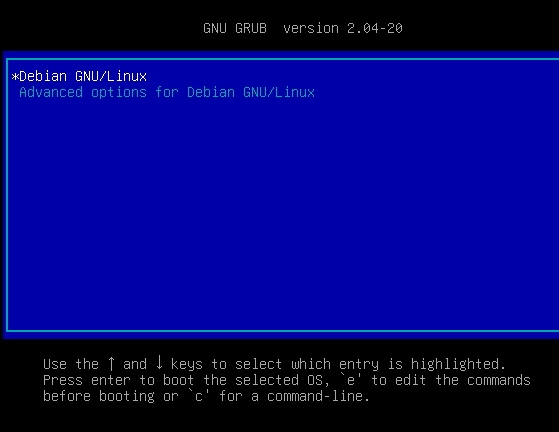
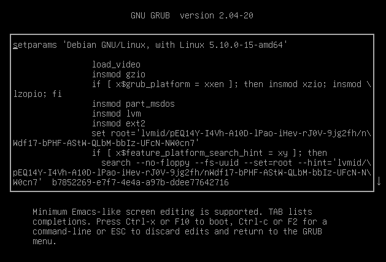
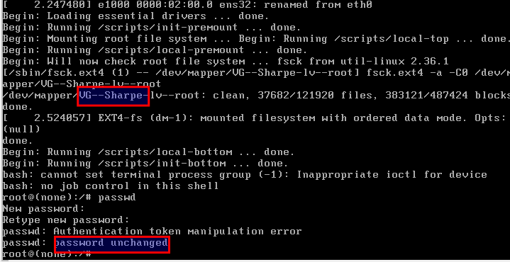
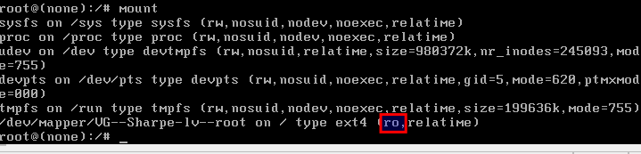

# Let Me In

Right now you should not have normal administrative access to your Linux machine, because neither the root password nor the regular user path is set up the way this lab needs.


## Single-User Mode

Single-user mode, sometimes called maintenance mode, is handled slightly differently across Linux distributions. Older systems often accepted the `single` keyword directly, while newer GRUB setups usually require you to edit the kernel boot line.

Boot the VM and press `Esc` when the bootloader appears so GRUB stops at the menu.



Press `e` to open the GRUB editor.



Locate the Linux boot line and replace `ro quiet` with `single init=/bin/bash`.


After making the change, press `Ctrl+X` to boot into single-user mode.

## Screenshot 1



Your screenshot must include both highlighted portions.

## Why Did the Password Not Change?

The root filesystem is mounted read-only in this mode.



Remount the root filesystem read-write with:

```bash
mount -o remount,rw /
```


The password change should succeed after that.

## Screenshot 2


Your screenshot must show:

- that the password was updated successfully
- the regular user account created during the Debian install

Type `exit` and the system will likely panic because it was booted into this recovery shell directly. Use the VMware reset option, then log in with your new password.

---
[Prev](01_evaluation.md) | [Home](README.md) | [Next](03_got-root.md)
