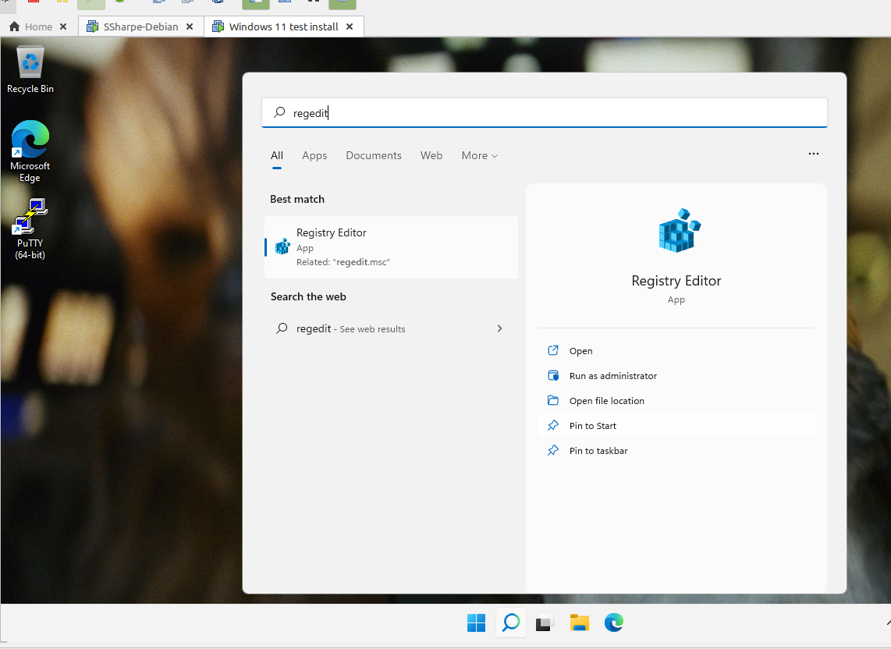
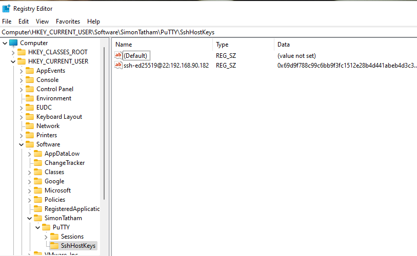
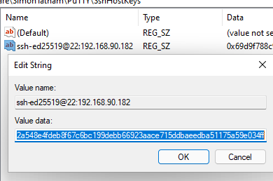
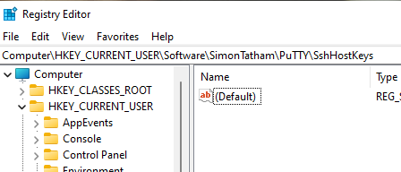
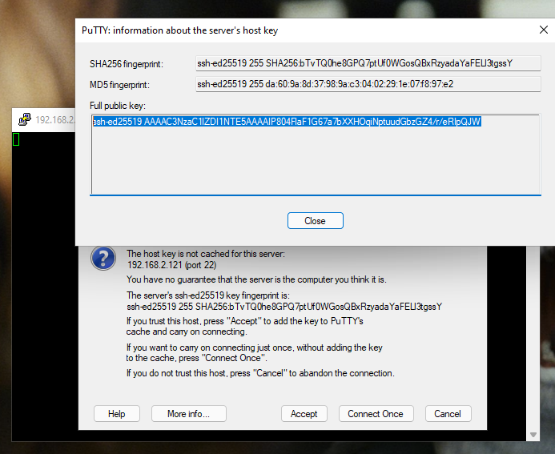
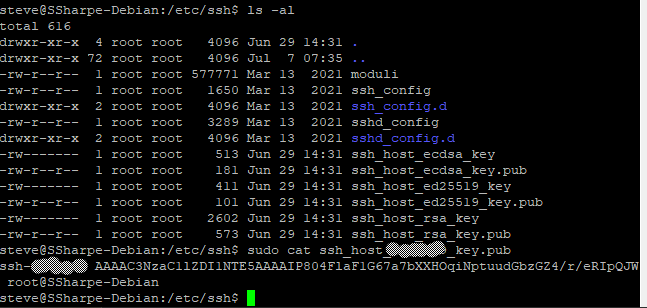
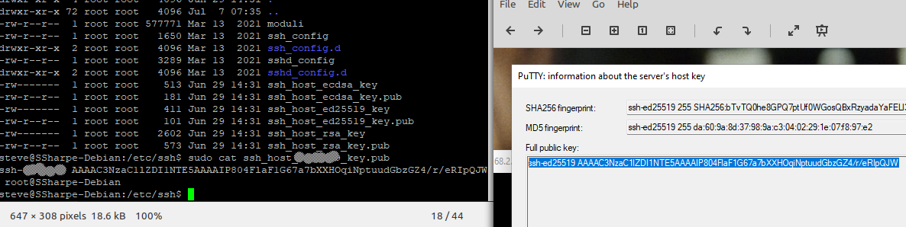

# Authenticating the Server

Before you log in to a server, make sure you are connecting to the correct one. SSH passwords are verified by the remote server, so a password-based login is still vulnerable to a man-in-the-middle attack if you trust the wrong host.

In this part of the lab you will compare the server's public key. This check is most useful after you have connected before and want to confirm that the saved host key has not changed unexpectedly.

PuTTY stores known hosts in the Windows registry, so first remove any saved host-key entries for this server.

Read both articles on bcrypt and salts. If you need the full joke, there is also a pepper.

[bcrypt](https://en.wikipedia.org/wiki/Bcrypt)

[salt](https://en.wikipedia.org/wiki/Salt_(cryptography))

## Remove saved PuTTY host keys

Search for **regedit** in the Windows Start menu.

Navigate to `HKEY_CURRENT_USER\SOFTWARE\SimonTatham\PuTTY\SshHostKeys`.

Double-click an entry if you want to inspect it. The value maps an address to a host key and includes the algorithm, such as `ed25519`.

Delete any saved mappings for this server so only **(Default)** remains.

Reconnect to the server and save a screenshot of the server's **public key**. Remember to click **More info**.

Once reconnected, locate the corresponding key on your Debian system and confirm that it matches what PuTTY displayed.

## Screenshot 1

In one easy-to-read image, show that the public key from the shell prompt on your Debian system matches the exact key displayed by PuTTY.

---
[Prev](01_evaluation.md) | [Home](README.md) | [Next](03_authenticating-the-user.md)
