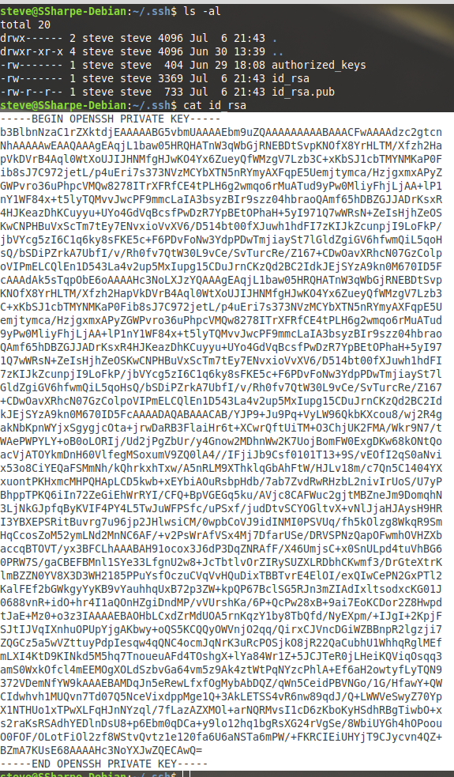
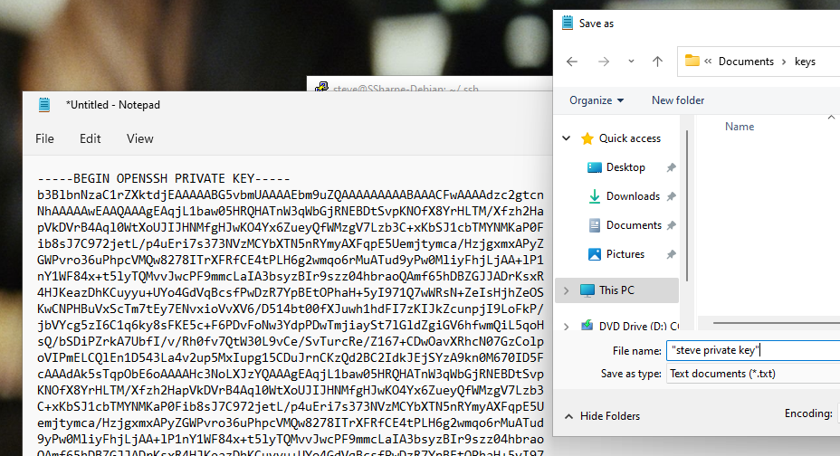
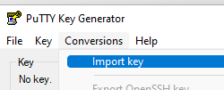
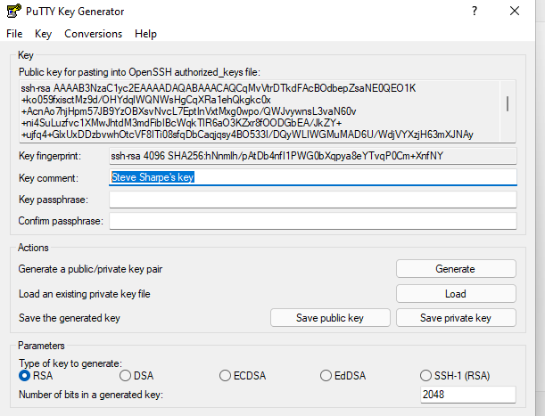
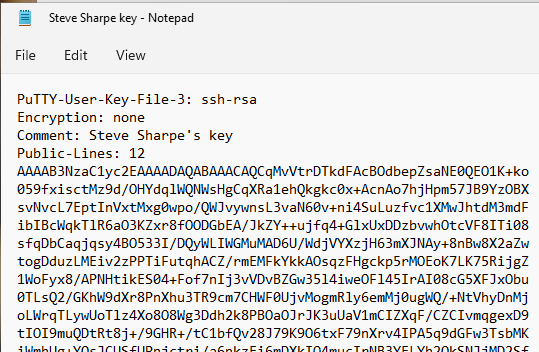
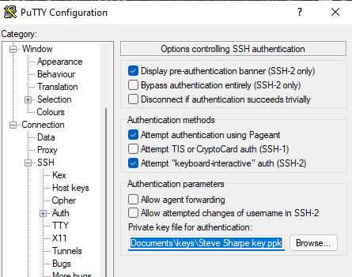
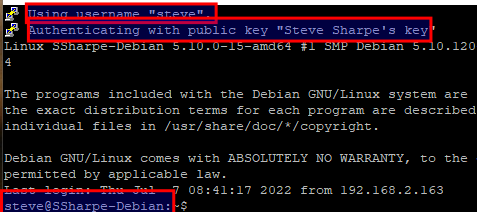

# Authenticating the User

In the previous lab you authenticated with only a username and password. If you authenticate with a key pair instead, the private key stays under your control and SSH can complete a challenge-response login without sending your password to the remote host.

Once `sshd` is installed and PuTTY is available, go a step further and use key-based logons instead of passwords.

First, generate an RSA key pair for the Linux user who will log in. The private key should stay under that user's control. If it is ever compromised, generate a new pair and remove the old one.

Log in to Debian as the user you want to use for this lab, then create a `.ssh` directory in that user's home folder and change into it.

Run:

**ssh-keygen -t rsa -b 4096 -C Your_First_Name**

This creates two files: **`id_rsa`** and **`id_rsa.pub`**. The `.pub` file is your public key. To use it for logon, place that public key in **`authorized_keys`** for the account you want to access.

PuTTY needs the private key in PuTTY's own format, so you will convert it with PuTTYgen.

In PuTTY, highlighted text is copied immediately to the clipboard. Be careful not to right-click, because PuTTY will paste immediately into the console.

You do want to copy the full contents of the private key so you can paste it into a Windows text editor such as Notepad.

Resize the PuTTY window so you can see the entire contents of `id_rsa`, then highlight all of it as shown below. **Do not right-click.**

Open Notepad and paste the contents.

There cannot be anything above `BEGIN OPENSSH PRIVATE KEY` or below the ending line. It must match exactly what was displayed in the Linux terminal.

If you do not already have one, create a `Documents\keys` folder first, then save the file there.

Name the file `Your_first_name private key`. Put quotes around the name or Windows will save it as a regular text file.

In Windows 11, search for **PuTTYgen**. Open it, then choose **Conversions > Import key**. Browse to the private-key file you just saved.

Change the key comment to read `Your Full Name's key`. If you are curious how PuTTYgen can derive the public key from the private key, read the linked article in the original lab material.

Leave the parameters section as-is, because it is only used when you click **Generate** to make a new key.

Click **Save private key** and store it beside the first file under `Documents\keys`. Call it `Your_Full_Name key.ppk`. It should already use the `.ppk` extension. For this lab, choose **Yes** when asked to save without a passphrase so the screenshot flow stays simple. In real use, add a passphrase.

Once it is saved, open the file with Notepad just so you can observe what PuTTY's `.ppk` format looks like. Use `*.*` to show all files if Windows only displays `*.txt`.

From the last lab, load the PuTTY saved session called `Your_first_name without a key`. That profile should already populate the username field. Then navigate to **Connection > SSH > Auth** and browse to your new private key.

Go back to **Session**, name this profile `Your_First_Name with a key`, and click **Save**.

In future connections, load that saved profile and then enter your current IP address until the Linux VM has a static address.

## Screenshot 2

Show a login that automatically uses the username without typing it manually and reports that it is authenticating with the public key that uses your full-name comment.

---
[Prev](02_authenticating-the-server.md) | [Home](README.md) | [Next](04_key-ring.md)
