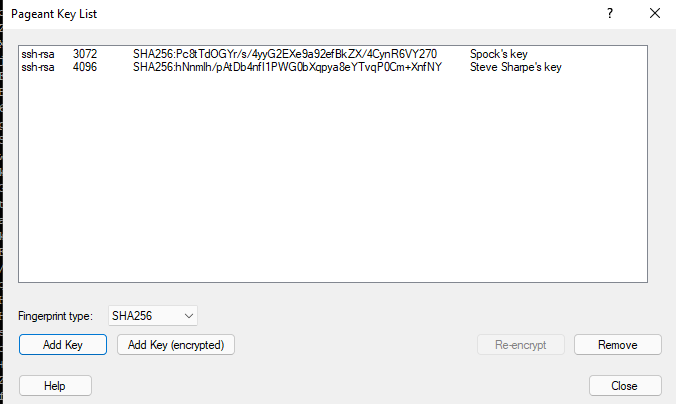
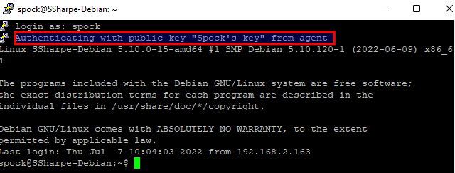

# Key Ring

On Windows 11, search for the application **Pageant**. This utility stores PuTTY private keys in memory.

This is useful because the previous step required you to specify a private key for one saved session. If you have many servers and many users, that setup becomes hard to manage quickly.

Using one of the superhero accounts you created on your Linux machine, create a key pair for that superhero.

Repeat the same process you used earlier to create a key and convert it into PuTTY's format.

Once you have the superhero's new `.ppk` file, import **both** your original key and the superhero key. In the example shown below, the keys are `Steve Sharpe's key` and `Spock`. The exact key lengths can differ.

Now go back to PuTTY and **do not** load a saved session. Simply enter the IP address to your Linux machine.

You should be prompted for a username, which is fine. Enter your superhero name and press Enter. You should not be prompted for a password, and the login should mention authentication **from agent**.

## Screenshot 3

Show your superhero account authenticating through the agent.

---
[Prev](03_authenticating-the-user.md) | [Home](README.md) | [Next](05_x11-forwarding.md)
