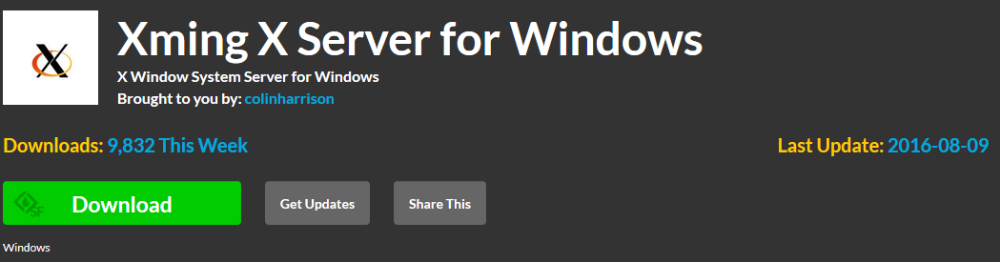
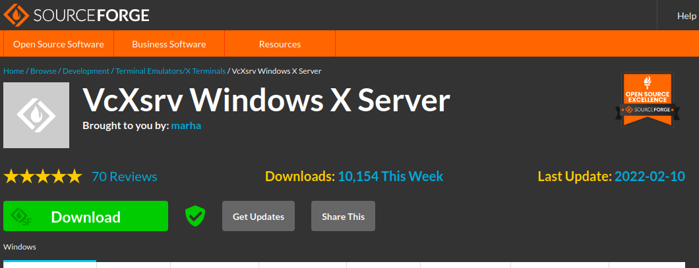
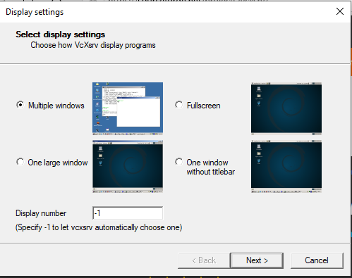
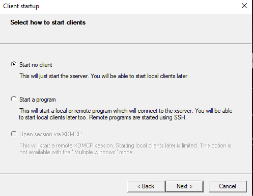
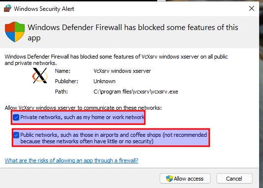
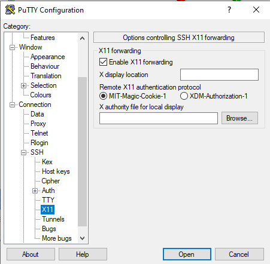
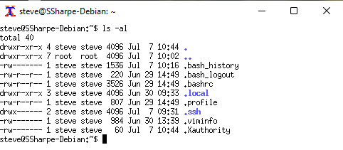

# X11 Forwarding

X11 forwarding can be used across platforms: Linux to Linux, Linux to Windows, or Linux to macOS. In this lab you will demonstrate Linux to Windows.

Xming used to be a common Windows choice, but it has not been updated in years.

For this exercise, use **VcXsrv Windows X Server** instead.

Download VcXsrv from SourceForge:

https://sourceforge.net/projects/vcxsrv/

Choose the default options during setup. Launch VcXsrv and allow traffic through when Windows prompts you.

Once installed, you should see **XLaunch** in the Windows 11 Start menu. If not, just search for it.

Close your existing PuTTY window and then reopen it. Before reconnecting to your Linux VM, enable **X11 forwarding** in **Connection > SSH > X11**.

After you connect, run the following workflow:

- Install `xterm`:
  `sudo apt install xterm`
- Try installing Firefox ESR:
  `sudo apt install firefox-esr`
- You will probably run out of disk space before Firefox finishes installing.
- Launch `xterm` over X11:
  `xterm&`
- A graphical `xterm` window should appear on your Windows desktop.
- After you learn more about LVM, you will resize the root volume so larger GUI applications can be installed and launched the same way.

## Screenshot 4

Show an `xterm` window with a long listing of your home directory.

---
[Prev](04_key-ring.md) | [Home](README.md)
