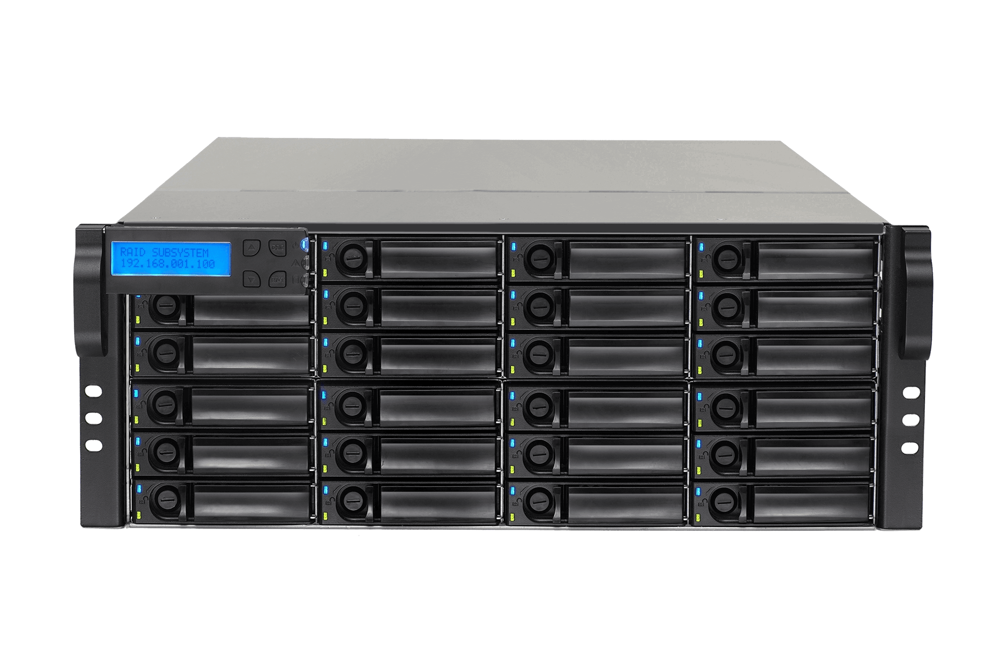
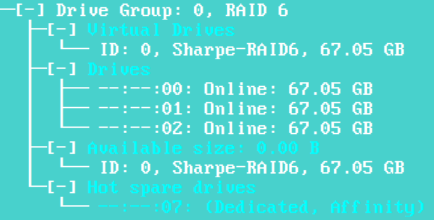
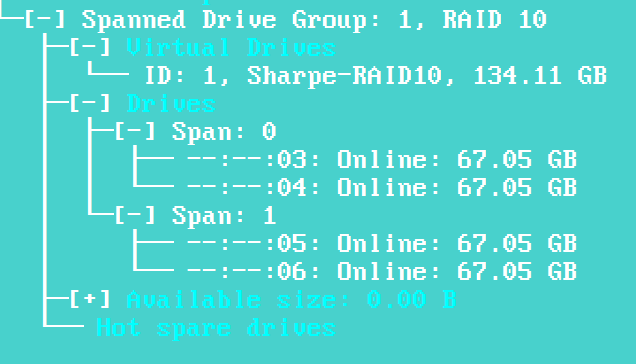

# Hardware RAID

## Required reading

Read the Intel RAID software guide from section **1.3 RAID Terminology** on page 12 through **2.4.5.1 Order of Precedence** on page 28.

[Intel RAID SW User Guide](https://drive.google.com/file/d/10cs1GSjoVhIlDO-XlpotMcGnre0lfRwM/view)

## Short review

- **Spanned Volume** combines multiple disks into one larger volume by filling one disk and then continuing to the next. It does not provide fault tolerance.
- **Striped Volume** or **RAID 0** splits data across multiple disks for better performance, but it also provides no fault tolerance.
- **Mirrored Volume** or **RAID 1** stores the same data on two disks. If one disk fails, the other still contains the data.
- **RAID 5** spreads data and parity across at least three disks. It can survive a single-disk failure while still improving read performance.

Download the Intel RAID controller software and build the two required arrays: RAID 6 and RAID 10.

[Intel RAID Controller](https://drive.google.com/file/d/1hwSbf-OeloyOngeMypSHA1O34HILRqiO/view)

## Screenshot 1

Create a RAID 6 array with the following criteria:

- Data disks in bays 0 through 3
- Hot spare in bay 7
- Volume name: `Lastname-RAID6`

## Screenshot 2

Create a RAID 10 array with the following criteria:

- Use drives in bays 3 through 6
- Volume name: `Lastname-RAID10`

---
[Home](README.md) | [Next](02_software-raid.md)
