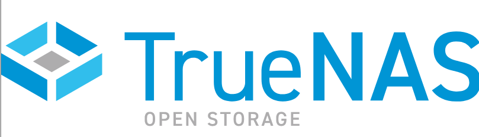
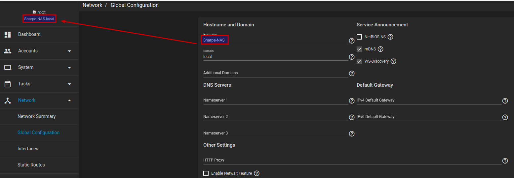
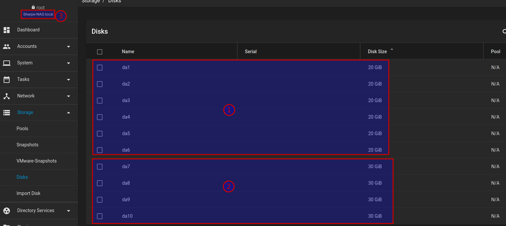
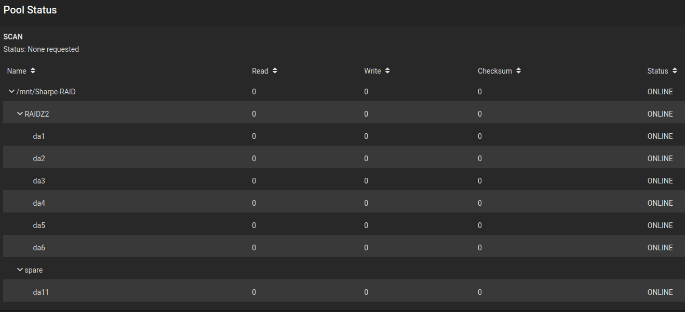
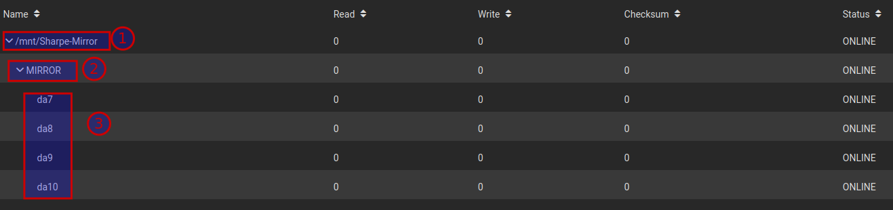

# Software RAID

Instead of building storage around iSCSI initiators and targets, this section uses a NAS approach with TrueNAS Core. The goal is to create software-defined redundant storage pools and verify them through the TrueNAS web interface.

## Download TrueNAS Core

> [!NOTE]
> Download the ISO from the instructor-provided link: [TrueNAS Core ISO](https://nscc-my.sharepoint.com/:u:/g/personal/w0305390_campus_nscc_ca/IQAFfI_lZRlNRLPgyhZ7KajVAXOo44JZOhNwl4u25_lEO2U)

1. Open the instructor-provided OneDrive link above.
2. Download the provided TrueNAS Core ISO.
3. Keep the ISO available for the VMware virtual machine setup.

## Create the virtual machine

1. Open VMware Workstation or VMware Player.
2. Start a new virtual machine and select the TrueNAS Core ISO as the installer image.
3. Name the VM `Lastname-NAS`.
4. Choose **Other > FreeBSD 13 (64-bit)** as the guest OS.
5. Assign at least 8 GB of RAM.
6. Create a new **SCSI** disk for the operating system.
7. Use a 100 GB thin-provisioned disk and name it `OS Disk.vmdk`.

## Create the data disks

Add ten additional virtual disks:

- six 20 GB disks
- four 30 GB disks

Name them clearly so you can identify them during pool creation.

## Install TrueNAS Core

1. Power on the VM.
2. Choose **Install/Upgrade** at the TrueNAS installer prompt.
3. Select the 100 GB OS disk for the boot environment.
4. Set a memorable temporary password for `root`.
5. Choose **Boot via BIOS**.
6. Wait for the installation to finish and reboot the VM.
7. Open the displayed IP address in a browser on the host system and log in as `root`.

Once installation is complete, change the hostname to `Lastname-NAS` under **Network > Global Configuration**.

## Screenshot 3

Show all of the following:

1. the six 20 GB drives
2. the four 30 GB drives
3. the hostname set correctly to `Lastname-NAS`

### 🎥 Installing TrueNAS

[Watch Video](https://youtu.be/2LThLD0B-UY)

## Create the pools

### RAID-Z2 pool

1. Go to **Storage > Pools** and choose **Add Pool**.
2. Import disks manually.
3. Select the six 20 GB disks.
4. Clear any option that marks the disks as preconfigured for an existing pool.
5. Choose **RAID-Z2** as the pool type.
6. Name the pool `Lastname-RAID6`.
7. Create the pool and wait for it to finish.

### Mirror pool

1. Repeat the pool-creation process with the four 30 GB disks.
2. Choose **Mirror** as the pool type.
3. Name the pool `Lastname-Mirror`.
4. Create the pool and verify that it comes online cleanly.

### Verify pool creation

Return to the **Pools** page and confirm that both pools appear with healthy or online status.

### 🎥 RAID 6 with hot spare

[Watch Video](https://youtu.be/JE9ggot4AKg)

## Screenshot 4

Show the summary of the RAID 6 style pool with all seven drives visible: six data drives and one hot spare.

## Screenshot 5

Create a mirror using the four 30 GB drives and show:

1. the `Lastname-Mirror` volume group
2. the pool type as mirror
3. all four 30 GB drives

---
[Prev](01_hardware-raid.md) | [Home](README.md)
