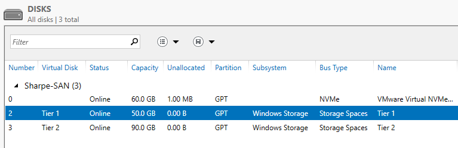

# Preparing Storage Volumes

## Objective

Prepare storage on `lastname-SAN` so it can later be published through the Windows iSCSI Target role.

Environment:

- `lastname-SAN`: `192.168.100.10`
- `lastname-FS`: `192.168.100.20`

## Part 1: Add and prepare the disk on `lastname-SAN`

1. Add a new `100 GB` VMDK disk to the `lastname-SAN` VM in VMware.
2. On `lastname-SAN`, open **Server Manager > File and Storage Services > Disks**.
3. Locate the new `100 GB` disk.
4. Bring it online and initialize it.
5. Create a new volume on that disk.
6. Format it with `NTFS`.
7. Assign a drive letter.

## Part 2: Create the storage tiers

1. In **Server Manager**, open **File and Storage Services > Storage Pools**.
2. Create a new storage pool using the new `100 GB` disk.
3. Inside that pool, create two thin-provisioned virtual disks:
   - `Tier 1 Storage` at `50 GB`
   - `Tier 2 Storage` at `90 GB`
4. Finish the wizard so both virtual disks appear as separate volumes.

This intentionally demonstrates over-provisioning because the combined virtual-disk sizes exceed the physical disk size.

### 🎥 Creating Storage Pools

[Watch Video](https://youtu.be/dtYzsv37-9U)

## Screenshot 1

Show the completed storage setup with:

1. the `Tier 1 Storage` volume
2. the `Tier 2 Storage` volume

---
[Prev](04_submission-requirements-for-the-iscsi-san-lab.md) | [Home](README.md) | [Next](06_setting-up-the-iscsi-target-on-lastname-san.md)
