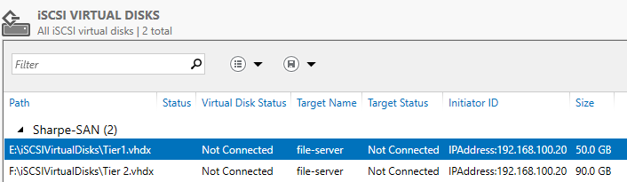
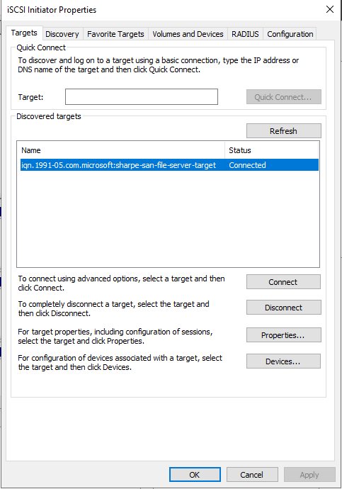
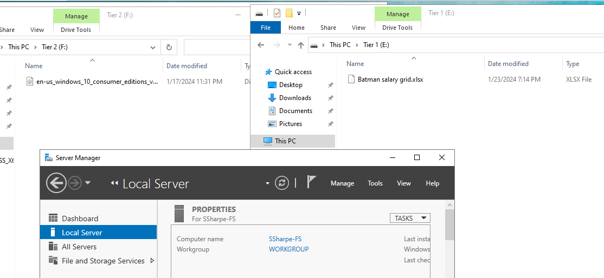

# Setting Up the iSCSI Target on `lastname-SAN`

## Install the iSCSI Target role

1. On `lastname-SAN`, open **Server Manager**.
2. Go to **Manage > Add Roles and Features**.
3. In **File and Storage Services**, enable **iSCSI Target Server**.
4. Complete the install.

## Create the iSCSI virtual disks and target

1. On `lastname-SAN`, open **Server Manager > File and Storage Services > iSCSI**.
2. Start the **New iSCSI Virtual Disk Wizard**.
3. Create one iSCSI virtual disk for `Tier 1 Storage`.
4. Create one iSCSI virtual disk for `Tier 2 Storage`.
5. Continue into the target wizard.
6. Name the target something clear such as `lastnameiSCSITarget`.
7. Authorize `lastname-FS` using IP address `192.168.100.20`.
8. Assign both newly created iSCSI virtual disks to the target.
9. Complete the wizard.

### 🎥 Creating Targets

[Watch Video](https://youtu.be/_gDubWGuQ0o)

## Screenshot 2

Show the completed iSCSI target configuration with the created target and the assigned virtual disks visible.

## Connect from `lastname-FS`

1. On `lastname-FS`, open **iSCSI Initiator**.
2. In the **Targets** tab, enter the IP address of `lastname-SAN`: `192.168.100.10`.
3. Choose **Quick Connect**.
4. Select `lastnameiSCSITarget`.
5. Connect to it successfully.

### 🎥 iSCSI Initiator

[Watch Video](https://youtu.be/BjOn6ajaH1c)

## Screenshot 3

Show the initiator on `lastname-FS` with the connection status indicating a successful connection to the target.

## Initialize and use the iSCSI disks on `lastname-FS`

1. Open **Disk Management** on `lastname-FS`.
2. Initialize both new iSCSI disks.
3. Create and format volumes on both disks.
4. Create a folder named `Tier 1 Storage` on one volume.
5. Create a folder named `Tier 2 Storage` on the other volume.
6. Place an Excel file in `Tier 1 Storage`.
   - Use the salaries-of-comic-characters idea from the original lab if you want to stay source-faithful.
7. Place any ISO file in `Tier 2 Storage`.

### 🎥 SAN in action

[Watch Video](https://youtu.be/K6oQhewwHgk)

## Screenshot 4

Show two File Explorer windows side by side on `lastname-FS`:

1. one side showing the Tier 1 location with the spreadsheet file visible
2. one side showing the Tier 2 location with the ISO file visible

Do not open the spreadsheet contents.

---
[Prev](05_preparing-storage-volumes.md) | [Home](README.md)
