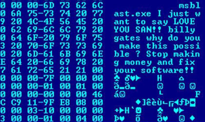

# Overview and Preparation

Malware comes in many forms. This lab focuses on an older **trojan horse** called NetBus.

A trojan horse allows remote access to a victim computer without the user's knowledge. It is commonly delivered through social engineering or by someone with direct access to the machine.

## Legacy NetBus note

The old NetBus homepage used by this lab is no longer available. The lab material identifies these operating systems as supported:

- Windows 95
- Windows 98

---
### 🧠 NetBus operating systems

> [!NOTE]
> **Question:** Which operating systems are identified in the lab material as supported by NetBus?
>
> - [ ] Windows 95
> - [ ] Windows 98
> - [ ] Windows XP
> - [ ] Windows 10

👉 <b>Check your answer</b>

**Correct Options:** Windows 95 and Windows 98

---

## Required files

Use these provided VM archives:

- [Windows 7 lab image](https://www.dropbox.com/scl/fo/gnns596hl7kckt3ntwrce/AKIUK4w-w7-_3Z0W-YFGEi8/INFO6001/Win7.7z?rlkey=ziz2z8il2vj4pkm7r79fyqzpk&e=1&dl=0)
- [Windows Server 2008 lab image](https://www.dropbox.com/scl/fo/gnns596hl7kckt3ntwrce/AGVxECByPsAwb83p-OyuqrI/INFO6001/S2008R2.7z?rlkey=ziz2z8il2vj4pkm7r79fyqzpk&e=1&dl=0)
- NetBus lab files on the Windows 7 VM in `C:\Security\netbus`

The Windows 7 VM listing shows these NetBus files:

- `C:\Security\netbus\Patch.exe`
- `C:\Security\netbus\NetBus.exe`
- `C:\Security\netbus\NetBus.rtf`

There is also a nested copy under:

- `C:\Security\netbus\netbus`

## Compatibility note

The lab material explains that the exercise is normally defeated on Windows XP and later unless a protection feature is disabled on the lab machines.

---
### 🧠 Compatibility check

> [!NOTE]
> **Question:** What must be disabled on the lab systems for this older NetBus exercise to work?

👉 <b>Reveal answer</b>

**Correct answer:** Windows Defender

---
[Home](README.md) | [Next](02_ports-and-netstat-review.md)
