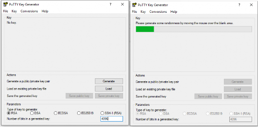
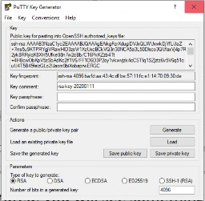

# Generate SSH Keys with PuTTYgen

Start by opening PuTTYgen.

## Create the key pair

1. Leave the key type set to `RSA`.
2. Change the key size to `4096`.
3. Click **Generate**.
4. Move the mouse inside the blank area until the key finishes generating.

Once generation finishes, PuTTYgen shows the public key text and enables the save options.

## Save the files you need

Save these items into a dedicated folder such as `Documents\sshkeys`:

- the private key as a `.ppk` file for PuTTY
- the public key if you want a saved local copy
- an exported OpenSSH key only if another tool specifically needs that format

For naming, use something descriptive and reusable, such as:

- `school-linux-key.ppk`
- `school-linux-key.pub`

## Choose a useful key comment

Replace the default comment with something meaningful, such as:

- `yourusername@yourpc`
- `yourusername@windows`

## Passphrase guidance

A passphrase on the private key is strongly recommended in real use. If this guide is being followed in a controlled classroom environment, leaving it blank may be acceptable for simplicity, but that is a classroom shortcut, not the best long-term practice.

## Keep this distinction clear

- the public key is meant to be shared
- the private key must stay private

---
[Prev](01_introduction.md) | [Home](README.md) | [Next](03_publish-your-public-key-to-github.md)
