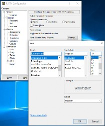
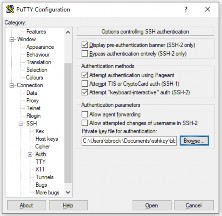
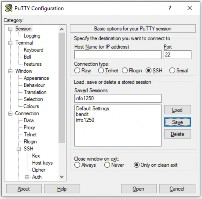
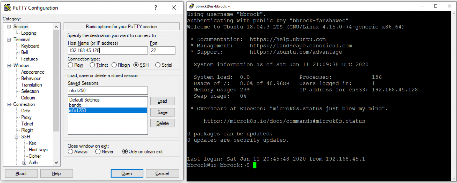

# Configure PuTTY to Use Your Private Key

PuTTY can store connection settings so you do not need to rebuild the same SSH configuration each time.

## Optional: adjust the display font

If the default text is too small, change it before saving the session.

## Set the login username

Under **Connection > Data**, enter the username you use on the Linux system in **Auto-login username**.

## Point PuTTY to the private key

Open **Connection > SSH > Auth** and browse to the `.ppk` file you created in PuTTYgen.

## Save a reusable session

Go back to the **Session** page, enter a clear saved-session name, and click **Save**.

Suggested examples:

- `ubuntu-key`
- `centos-key`

If you want separate profiles for different systems, save one profile per host.

## Connect and test

Load the saved session, enter the server IP address if needed, and connect.

If everything is configured correctly, PuTTY should:

- use the saved username
- present the `.ppk` key automatically
- avoid a normal password prompt unless your key itself has a passphrase

---
[Prev](04_install-your-key-on-both-linux-systems.md) | [Home](README.md) | [Next](06_mac-file-and-directory-basics.md)
