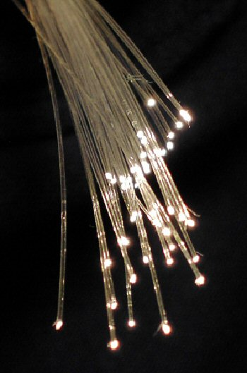

# Classifying Security Controls and Business Processes

Use the examples below to practice the distinction between:

- confidentiality
- integrity
- availability
- business process

## Example: self-checkout system

Imagine a store is pitching a self-checkout deployment. During that pitch, some items are true security controls and others are just business-process choices.

### Sample observations

- The self-checkout system uses a central server.
- The server has four disks in a RAID 10 configuration.
- The checkouts are connected by fibre optics for the fastest response time.
- The systems have a primary fibre connection and a backup wireless connection.
- The systems do not store credit-card information after payment.
- Cameras are used to discourage shoplifting.
- The systems have dual power supplies.
- The systems have dual scanners for easier scanning.

## Fibre example

These two statements sound similar, but they point to different ideas:

- **Fibre for faster response time** is a **business-process** decision.
- **Fibre because it is harder to intercept than copper** is a **confidentiality** decision.

That difference matters. You need to classify the reason for the design choice, not just the technology itself.

## What you should notice

Examples from this lesson map out like this:

- RAID 10 on the server -> availability
- Backup wireless link -> availability
- Not storing credit-card data after payment -> confidentiality
- Fibre for fastest response time -> business process
- Cameras to discourage shoplifting -> business process
- Dual scanners for easier scanning -> business process

You will use this kind of reasoning in Part A of the assignment.

---
[Prev](01_managing-risk-and-the-cia-triad.md) | [Home](README.md) | [Next](03_attack-tree-basics-in-adtool.md)
