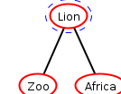
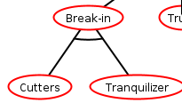

# Attack Tree Basics in ADTool

For Part B of the assignment, you will build an attack tree in ADTool.

## Get the tool

- [ADTool download page](https://satoss.uni.lu/members/piotr/adtool/)
- [ADTool manual (PDF)](https://satoss.uni.lu/members/piotr/adtool/manual.pdf)

## What an attack tree does

An attack tree starts with a single objective at the top and then breaks that objective into smaller ways of achieving it.

Typical elements include:

- the root objective
- alternative paths
- dependent steps
- countermeasures
- attacker responses to those countermeasures

## Disjunctive refinement

Disjunctive refinement means there is more than one valid path forward. In plain language, this is the **OR** case.

In this example, the objective can be reached by either:

- `Zoo`
- `Africa`

Those branches are alternatives, not dependent steps.

## Conjunctive refinement

Conjunctive refinement means the child steps are dependent on each other. In plain language, this is the **AND** case.

In this example, the `Break-in` path depends on multiple required steps, not just one.

## What to do in ADTool

As you work in ADTool:

1. create the root objective first
2. add major branches beneath it
3. decide whether each group is OR or AND
4. add defenses or countermeasures where appropriate
5. add attacker responses if they matter to the path
6. save your work
7. export the finished tree as a PNG image

The exported PNG is what you will place into your Word document.

---
[Prev](02_classifying-security-controls-and-business-processes.md) | [Home](README.md) | [Next](04_worked-attack-tree-examples.md)
