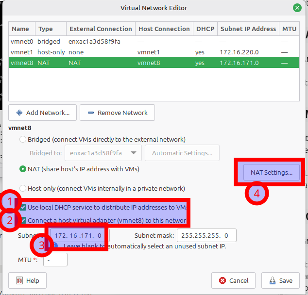
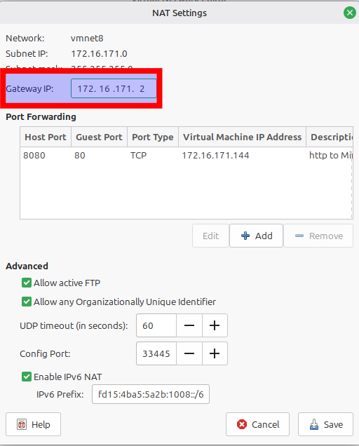

# Overview and VMware Prep

## Overview

In this lab, you will build the pfSense firewall yourself instead of exploring a prebuilt package.

You will:

- prepare one Debian VM as `dmz`
- configure the public and internal-only web services once
- clone that Debian VM twice into `inside` and `outside`
- build pfSense with four NICs
- use the pfSense console only enough to finish the install and reach the GUI
- finish the real interface, DHCP, reservation, NAT, and hardening work in the pfSense web interface

## Learning Goals

By the end of this lab, you should be able to:

- map VMware NICs to pfSense interfaces by MAC address
- explain why `outside/WAN` must use VMware `NAT`
- explain why `MGMT` belongs on a separate VMware `host-only` network
- configure pfSense `LAN`, `DMZ`, `MGMT`, DHCP scopes, and a DHCP reservation
- expose a public `DMZ` service on `WAN` port `80`
- keep an internal-only `DMZ` service off the public `WAN`
- harden the pfSense GUI so it is reachable only from `MGMT`

## Final Network Plan

| Device | Network | Addressing | Role |
| --- | --- | --- | --- |
| `pfSense WAN` | VMware `NAT` network such as `VMnet8` | `DHCP` | outside-facing interface with internet access |
| `pfSense LAN` | `inside` LAN Segment | `10.10.10.200/24` | inside gateway |
| `pfSense DMZ` | `dmz` LAN Segment | `10.20.20.200/24` | DMZ gateway |
| `pfSense MGMT` | VMware `host-only` network | `<host-only subnet>.200/24` | management-only interface |
| `outside` | VMware `NAT` network such as `VMnet8` | `DHCP` | outside client |
| `inside` | `inside` LAN Segment | `DHCP from pfSense` | internal client |
| `dmz` | `dmz` LAN Segment | `DHCP reservation 10.20.20.100` | public and internal-only server |
| `host computer` | VMware `host-only` network | current host-only adapter IP | pfSense management browser |

Service plan:

- `dmz` port `80`: public page
- `dmz` port `8080`: internal-only page

Use these internal networks exactly:

- `LAN = 10.10.10.0/24`
- `DMZ = 10.20.20.0/24`

Use these DHCP scopes exactly:

- `LAN DHCP = 10.10.10.100 - 10.10.10.149`
- `DMZ DHCP = 10.20.20.101 - 10.20.20.149`

Use this `DMZ` reservation exactly:

- `10.20.20.100`

Keep the `DMZ` reservation outside the `DMZ` DHCP pool.

## Step 0. Verify VMware Networking Before You Build Anything

Open VMware Workstation and then open:

- `Edit > Virtual Network Editor`

For this lab, you need:

- one VMware `NAT` network for `outside` and `pfSense WAN`
- one VMware `host-only` network for `pfSense MGMT`
- one LAN Segment named `inside`
- one LAN Segment named `dmz`

### VMware `NAT`

Use the existing VMware `NAT` network on your workstation. This is often:

- `VMnet8`

Find the current `NAT` subnet and gateway from VMware.

Example:





> [!NOTE]
> The second screenshot includes an example VMware `NAT` port-forward entry from the instructor workstation. Ignore any specific forwarding rows you see in that example. In this lab, pfSense will do the important port forward later.

From the VMware `NAT` network, record these ideas:

- `.1` is the host on the VMware `NAT` network
- `.2` is the VMware `NAT` gateway
- `.254` is the VMware DHCP server

### VMware `host-only` for `MGMT`

Use one VMware `host-only` network for `MGMT`.

Confirm:

- the network is `Host-only`
- **Connect a host virtual adapter to this network** is enabled
- you know the subnet of that `host-only` network

From the VMware `host-only` network, record these ideas:

- `.1` is the host computer on that host-only network
- `.254` is the VMware DHCP server

For this lab, place the pfSense `MGMT` interface at:

- `<host-only subnet>.200`

Use `.200` for consistency unless that address is already in use on your workstation.

### LAN Segments

Create these LAN Segments if they do not already exist:

- `inside`
- `dmz`

Use the exact same segment names everywhere.

These names are case-sensitive.

## Step 1. Prepare the Base Debian VM as `dmz`

Assume you already know how to create a basic Debian VM.

Start with one Debian VM that will become `dmz`.

Before you install packages, keep this base Debian VM on the VMware `NAT` network temporarily.

Why:

- `apt update` and `apt install` need internet access
- the `dmz` LAN Segment is isolated until pfSense is built and configured

Do **not** move the base VM to the `dmz` LAN Segment until Step 3.

Set the hostname:

```bash
sudo hostnamectl set-hostname dmz
```

Install `nginx`:

```bash
sudo apt update
sudo apt install -y nginx
```

Create the public page on port `80`:

```bash
cat <<'EOF' | sudo tee /var/www/html/index.html >/dev/null
I am dmz
EOF
```

Create a separate docroot for the internal-only service:

```bash
sudo mkdir -p /var/www/intranet

cat <<'EOF' | sudo tee /var/www/intranet/index.html >/dev/null
This is the secret internal service. Outside is not invited.
EOF
```

Create a second `nginx` site on port `8080`:

```bash
cat <<'EOF' | sudo tee /etc/nginx/sites-available/intranet-8080 >/dev/null
server {
    listen 8080 default_server;
    listen [::]:8080 default_server;
    root /var/www/intranet;
    index index.html;
    server_name _;

    location / {
        try_files $uri $uri/ =404;
    }
}
EOF

sudo ln -s /etc/nginx/sites-available/intranet-8080 /etc/nginx/sites-enabled/intranet-8080
sudo systemctl restart nginx
```

Validate the base VM:

```bash
curl http://127.0.0.1
curl http://127.0.0.1:8080
```

Expected results:

- port `80` returns `I am dmz`
- port `8080` returns `This is the secret internal service. Outside is not invited.`

## Step 2. Clone the Debian VM Twice

Clone the base `dmz` VM twice.

Rename the clones:

- `inside`
- `outside`

On the `inside` clone:

```bash
sudo hostnamectl set-hostname inside

cat <<'EOF' | sudo tee /var/www/html/index.html >/dev/null
I am inside
EOF
```

On the `outside` clone:

```bash
sudo hostnamectl set-hostname outside

cat <<'EOF' | sudo tee /var/www/html/index.html >/dev/null
I am outside
EOF
```

Callout for the clones:

- leave the public site on port `80`
- disable the `8080` site on `inside` and `outside` so only `dmz` keeps the internal-only service

One simple way to disable the `8080` site on `inside` and `outside` is:

```bash
sudo rm /etc/nginx/sites-enabled/intranet-8080
sudo systemctl restart nginx
```

## Step 3. Attach Each Debian VM to the Correct Network

Because the base Debian VM started on VMware `NAT`, each clone inherits that adapter until you change it.

Before you move on, change and verify the VMware adapter for each Debian VM so each VM has only the single final adapter it should use:

- `dmz` uses the `dmz` LAN Segment
- `inside` uses the `inside` LAN Segment
- `outside` uses the VMware `NAT` network

At this point:

- `outside` should still be able to use VMware `NAT` and DHCP
- `inside` and `dmz` will not get useful addresses until pfSense is ready to provide DHCP

There is no required screenshot on this page.

---
[Home](README.md) | [Next](02_verify-hosts-and-open-pfsense.md)
