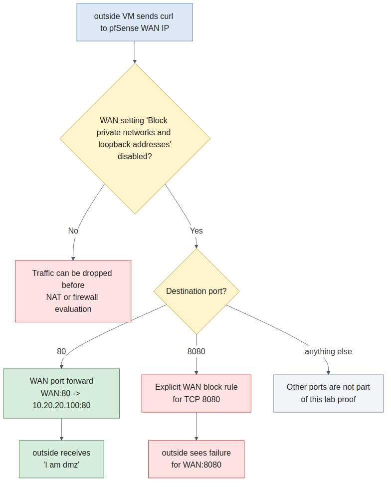

# Configure pfSense in the GUI

## Step 9. Rename the Interfaces and Finish the IP Plan

If you forget which VMware network or LAN Segment belongs to each pfSense interface, jump back to the topology map in page 01.

Use the diagram below for a different purpose:

- this one is the address and service reference
- it is here to help while you set interface IPs, DHCP, the `DMZ` reservation, and the public-vs-internal service behavior
- it is not the same as the page 01 connection map


Diagram source: [Mermaid](assets/images/pfsense-addressing-services.mmd)

In the pfSense GUI, use:

- `Interfaces > Assignments`
- the individual interface pages under `Interfaces`

Before you change anything in the GUI, confirm that `Interfaces > Assignments` already shows:

- `WAN`
- `LAN`
- `OPT1`
- `OPT2`

If `OPT1` or `OPT2` are missing, stop and go back to the pfSense console.

Use console Option `1` to assign interfaces and Option `2` to set interface IPs.

Do **not** try to create missing optional interfaces from the GUI while you are connected over the fresh-install management path.

In other words, by the time you reach this page, you should already know which pfSense interface became the future `MGMT` path.

You know that from the VMware MAC table and the console assignment step, not from guessing in the GUI.

Use `Interfaces > Assignments` only to confirm that the right NIC is already bound to:

- `WAN`
- `LAN`
- `OPT1`
- `OPT2`

On this pfSense build, the friendly interface name is set on the interface page itself through the `Description` field.

So after you confirm the NIC mapping in `Interfaces > Assignments`, open:

- `Interfaces > OPT1`
- `Interfaces > OPT2`

Rename the extra interfaces there:

- before you rename anything, cross-check the MAC-address table from Screenshot 1 and make sure each optional interface still matches the NIC you think it does
- on `Interfaces > OPT1`:
  - set `Description = DMZ`
  - set `IPv4 Configuration Type = Static IPv4`
  - set `IPv4 Address = 10.20.20.200`
  - set the prefix dropdown to `/24`
- on `Interfaces > OPT2`:
  - set `Description = MGMT`
  - confirm `IPv4 Configuration Type = Static IPv4`
  - confirm `IPv4 Address = <host-only subnet>.200`
  - confirm the prefix dropdown is `/24`

After you change an interface page, click:

- `Save`
- then `Apply Changes` if pfSense presents the pending-changes banner

Do not assume the new address or name is live until pfSense has applied the change.

> [!CAUTION]
> **During the rename/configuration step, change only the fields the lab actually asks for on the correct interface page.**
>
> Do **not** use this step to experiment with:
>
> - a different NIC assignment
> - disabling and re-enabling interfaces “just to see”
>
> Students who lose the GUI often do it here by changing the wrong optional interface or by damaging the future `MGMT` interface while trying to rename it.
>
> On the `Interfaces > Assignments` page, selecting a NIC in a row does **not** "add" that NIC. It reassigns that existing interface slot to a different NIC. If you pick the wrong NIC in the `LAN` row, you can replace the real `LAN` interface and collapse your reachable management path.

On the `DMZ` and `MGMT` interface pages, make sure each interface is enabled.

On those interface pages, also make sure the IPv4 configuration is what you actually intend:

- `DMZ` should use `Static IPv4`
- `MGMT` should use `Static IPv4`
- `WAN` should stay on `DHCP`

If you leave an optional interface on `None`, pfSense will not treat it as a normal IPv4 interface later.

Before you leave Step 9, explicitly verify:

- `MGMT` is enabled
- `MGMT` still has `<host-only subnet>.200/24`
- the interface you renamed to `MGMT` is still the NIC from your MAC-address table that connects to VMware `host-only`

> [!WARNING]
> **Check the prefix length before you save an interface IP.**
>
> pfSense can default to `/32` in some GUI forms.
>
> For this lab, your `LAN`, `DMZ`, and `MGMT` interfaces should be normal `/24`
> networks, not `/32` host routes. If you accidentally save `/32`, the
> interface can become unreachable even if the IP address itself looks correct.

If ARP later works but `ping` and the GUI do not, come back to these three checks first.

Make sure you end up with these logical interface names:

- `WAN`
- `LAN`
- `DMZ`
- `MGMT`

Use these final addresses:

- `LAN = 10.10.10.200/24`
- `DMZ = 10.20.20.200/24`
- `MGMT = <host-only subnet>.200/24`
- `WAN = DHCP`

On the `WAN` interface page, disable:

- `Block private networks and loopback addresses`

> [!CAUTION]
> **Check this setting on your build before you trust the `WAN` tests.**
>
> VMware `NAT` uses a private RFC1918 subnet, and your pfSense `WAN` interface
> and `outside` VM both sit on that private subnet.
>
> On some builds, if `Block private networks and loopback addresses` is enabled,
> pfSense can drop `outside -> WAN` traffic before your port forward or block
> rule is ever evaluated. Your rules can look correct and still do nothing.
>
> For this lab, if that setting is enabled on `WAN`, disable it, then save and apply the change.

When this is done, use:

- `Status > Interfaces`

Record the current `WAN` IP. You will need it later when you test traffic from `outside`.

## **Screenshot 2: pfSense Interface Names and IP Addresses**
**Requirement:** Show `Status > Interfaces` with `WAN`, `LAN`, `DMZ`, and `MGMT` visible and their IP addresses readable.

## Step 10. Enable DHCP on `LAN` and `DMZ`

In pfSense, open:

- `Services > DHCP Server > LAN`
- `Services > DHCP Server > DMZ`

If the `DMZ` tab is missing, stop and go back to Step 9 first.

That usually means the future `DMZ` interface is still not set to:

- enabled
- `Static IPv4`
- the correct `/24` address

Use these exact ranges:

- `LAN DHCP = 10.10.10.100 - 10.10.10.149`
- `DMZ DHCP = 10.20.20.101 - 10.20.20.149`

## Step 11. Create the `DMZ` Reservation

On the `dmz` Debian VM, find the MAC address of the active NIC:

```bash
ip -br link
```

Ignore `lo`.

Use that MAC address to create a DHCP reservation in pfSense for the `dmz` host:

- IP address: `10.20.20.100`

After the reservation is in place, renew the `dmz` lease or reboot the VM.

If you want to renew from the shell instead of rebooting:

```bash
sudo dhclient -r
sudo dhclient
```

Do the same on `inside` if it still does not have a `10.10.10.x` address.

Validate:

- `inside` gets an address in `10.10.10.100 - 10.10.10.149`
- `dmz` gets `10.20.20.100`

## Step 12. Create the Public `WAN` Port Forward and the Blocked `WAN` Rule

For this lab, leave:

- `Firewall > NAT > Outbound`

on its default automatic mode.

In pfSense, create a port forward on:

- interface: `WAN`
- protocol: `TCP`
- destination: `WAN address`
- destination port: `80`
- redirect target IP: `10.20.20.100`
- redirect target port: `80`

When pfSense offers to create the associated filter rule, allow it.

Then add an explicit `WAN` block rule for:

- protocol: `TCP`
- destination port: `8080`
- logging enabled

This gives you a clean public-vs-internal-only proof later:

- `outside -> WAN:80` should work
- `outside -> WAN:8080` should fail

Use this quick path diagram as a memory aid for those two inbound `WAN` tests. It does not replace the real `curl` proof on the next page.



Diagram source: [Mermaid](assets/images/pfsense-wan-inbound-path.mmd)

## Step 13. Harden Management by Removing the Automatic `WAN` GUI Path

Before you change the admin-access behavior, take a VMware snapshot of the pfSense VM.

Why:

- this is still the riskiest management step in the lab
- if you make a mistake, you can revert to a known working state instead of rebuilding the firewall from the beginning

Before you tighten management, create the `MGMT` firewall rule that will let your host computer reach pfSense on the trusted management path.

In pfSense, open:

- `Firewall > Rules > MGMT`

Add a pass rule with these values:

- action: `Pass`
- protocol: `TCP`
- source: `MGMT net`
- destination: `This Firewall (self)`
- destination port: `HTTPS`

Save and apply the rule.

Why this matters:

- `MGMT` is an OPT-style interface
- new OPT-style interfaces do not get open firewall rules by default
- if you tighten management first and do not add this rule, you can lock yourself out

Why this rule was not required earlier on this pfSense build:

- the webConfigurator still had its automatic `WAN` anti-lockout path
- this `MGMT` rule matters once you remove that automatic `WAN` GUI allowance
- if `MGMT` worked for you earlier, that does not mean the `MGMT` firewall rule is optional

If you lock yourself out here but `MGMT` is still the correct interface with the correct host-only `.200/24` address, use the policy-lockout recovery on the troubleshooting page.

If `MGMT` is missing, blank, or on the wrong NIC, do **not** use that recovery path. Fix the interface mapping first.

Before you change the admin-access behavior, move to the `outside` VM and open one terminal window.

In that same terminal, run this command against the current pfSense `WAN` IP:

```bash
hostname
curl -kI https://<WAN_IP>
```

You should see HTTP headers.

Run this from `outside`, not from your host computer. On this pfSense build, this gives you a before-and-after proof on the automatic `WAN` GUI path that this hardening step is supposed to remove.

Leave this terminal open. Do **not** clear it.

If that command does not return headers before hardening, stop and re-check:

- the current `WAN` IP is correct
- you are really testing from the `outside` network
- the pfSense GUI is still reachable before you tighten management

Now go back to pfSense and open:

- `System > Advanced > Admin Access`

On this pfSense build, the key control is:

- `Anti-lockout`
- `Disable webConfigurator anti-lockout rule`

Check that box and save the change.

What this does on this lab build:

- before hardening, the webConfigurator is still reachable from `outside` on the current `WAN` IP
- checking this box removes the automatic GUI safety path
- after that, GUI access is controlled by your real firewall rules instead of the automatic safety rule

Because you already created the `MGMT` HTTPS pass rule, your trusted management path should remain `MGMT` while the automatic `WAN` management path disappears

Then return to `outside` and run the same command again:

```bash
curl -kI https://<WAN_IP>
```

Expected result:

- before hardening, the command returned HTTP headers
- after hardening, the command should fail, return connection refused, or time out because the automatic `WAN` GUI path is gone
- keep both results visible in the same terminal window for Screenshot 3

From your host computer, confirm the GUI still opens on:

```text
https://<MGMT_IP>
```

If your browser shows a certificate warning again when you switch from the `WAN`
IP to the `MGMT` IP, that is expected.

You changed the IP address you are using to reach the same webConfigurator, so
the browser may treat it like a new site. Bypass the warning, then confirm that
the pfSense login page or dashboard still opens on `MGMT`.

> [!WARNING]
> **If `outside -> https://<WAN_IP>` still works after hardening, stop and inspect the live `WAN` rules before you trust your result.**
>
> That usually means your pfSense VM is not on a clean baseline. A broad `WAN`
> pass rule, especially one added by earlier recovery work or `pfSsh.php`, can
> keep the GUI reachable from `outside` even after you disable the automatic
> anti-lockout path.
>
> In that situation, your hardening result is contaminated. Remove the
> unintended `WAN` rule, apply the firewall changes, and test again.

## **Screenshot 3: GUI Access Before and After Hardening**
**Requirement:** In one screenshot, show the `outside` VM hostname, one successful `curl -kI https://<WAN_IP>` result before hardening, and one failed attempt after the automatic `WAN` anti-lockout rule is disabled. Keep both results visible in the same terminal window.

---
[Prev](02_verify-hosts-and-open-pfsense.md) | [Home](README.md) | [Next](04_test-and-prove-traffic.md)
