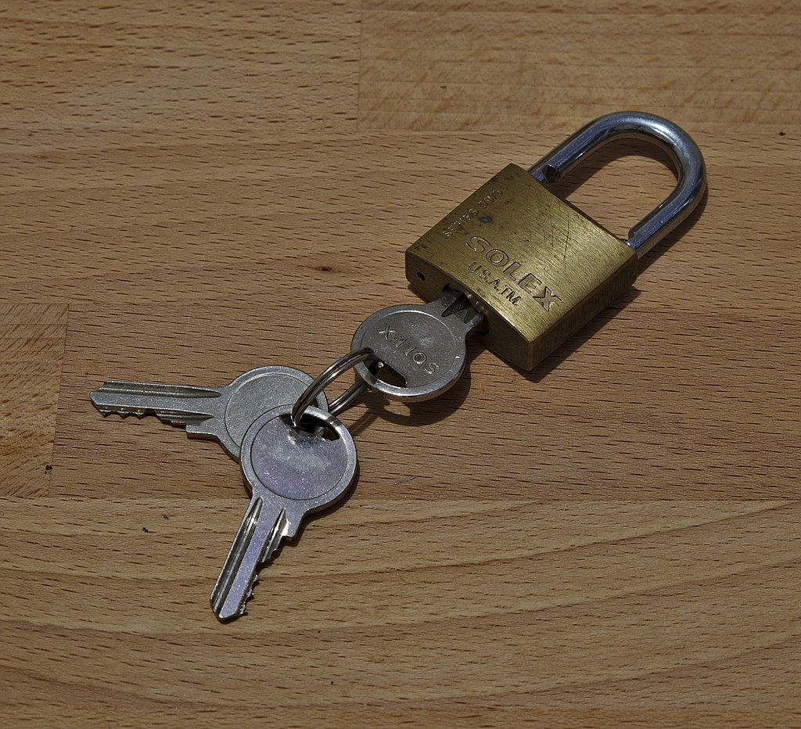

# Introduction

## Certs introduction

This lab will be using OpenSSL and Apache to illustrate the process from a company creating their own key pair, to requesting a certificate from a certificate authority to lastly installing that certificate in their web server to provide confidence to end users that that web communication is both secure and that the owner of the server is trusted.

Objectives:

- Create a certificate authority to sign certificates.
- Take a CSR and create the signed version.
- Set up a LAMP server.
- Create a CSR (Certificate Signing Request).
- Install the signed certificate in an Apache web page.

Prerequisites:

- VMware Workstation.
- Two copies of Linux. Copy 1 will serve as your certificate authority (`your_username-CA`) and Copy 2 will serve as your LAMP server (`your_username-LAMP`).
- A valid VMware Workstation snapshot before you start.

[Home](README.md) | [Next](02_house-keeping.md)
