# House Keeping

## Renaming machines

There are a few steps to renaming a computer.  We will cover the following files

/etc/hostname <--- where the actual hostname resides

/etc/hosts <-- the hostname requires an entry when the system tries to resolve its own name

We should always keep our hostname consistent with the VMware VM name

**Step 1**

Open /etc/hostname   (**sudo vi /etc/hostname**)

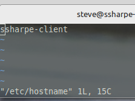

My current hostname is `your_username-client`. I'm going to change it to `your_username-CA`, then exit and save changes with `:wq` (Enter).

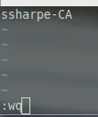

**Step 2**

Your system needs to resolve its own hostname. Similar to the hosts file in Windows, Linux also has one located at `/etc/hosts`.

Open the file

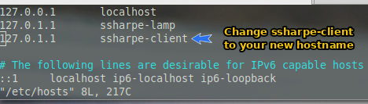

**Step 3 - Update VMware VM name**

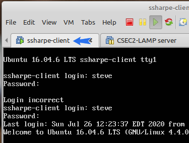

Select VM > Settings

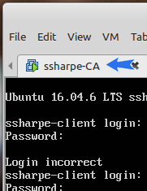

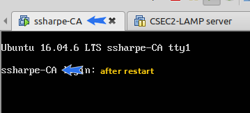

Now finally reboot after changing the VMware name

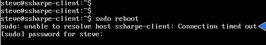

This is because our hostname and the entry and /etc/hosts do not match.  This will be resolved after restart.

## Networking

## Networking and Access Setup

The next steps are required:

1) Set a static IP for both the LAMP server and the CA. Record those IPs. See Lab 3 on setting static IP addresses.
2) Configure the hosts file so we can refer to each VM by name instead of IP address.
3) Exchange SSH keypairs between machines.
4) Disable the requirement to enter a password when using `sudo`.

2) Configure the hosts file so we can refer to each VM by name instead of IP address

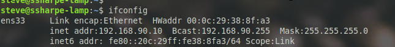

The static IP to my LAMP server is 192.168.90.10.  Go to your opposite machine which is your CA

On your CA open /etc/hosts and add an entry that maps your LAMP server to IP address as shown below

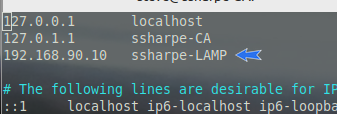

Test that the entry was successful by ping by hostname instead of IP

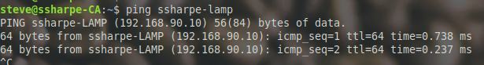

Repeat this process for the opposite server so you can ping both VMs by hostname instead of IP only.

3) Exchange ssh keypairs between machines

We will be using secure copy. This step is not required; however, it's always nice to save typing. When done, we will be able to copy between Linux VMs without typing our password.

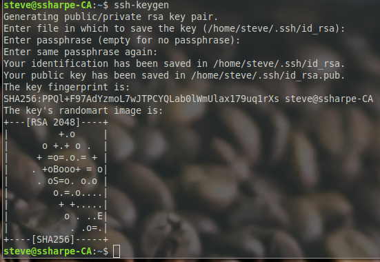

Make sure that both machines have a private and public keypair. The quickest way is to use the `ssh-keygen` script.

Last step is to use the `ssh-copy-id` script, which will securely copy our public key to the opposite computer.

Verify that this worked and that the hostname has changed to the target computer.

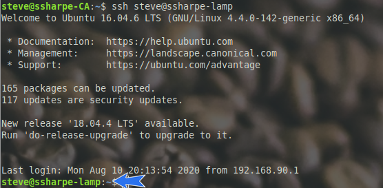

Repeat this process on the other VM

4) Disable the requirement to enter a password when using sudo

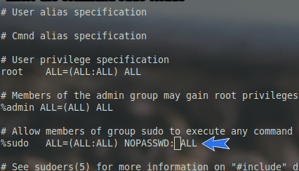

Use `visudo` to edit sudoers safely. Add `NOPASSWD:` before the `ALL` statement for the sudo group. A space is optional (`NOPASSWD:ALL` and `NOPASSWD: ALL` both work).

Repeat this on any computer where you want to bypass the password prompt when using `sudo`.

DO NOT DO THIS IN PRODUCTION.

[Prev](01_introduction.md) | [Home](README.md) | [Next](03_preparing-lamp.md)
