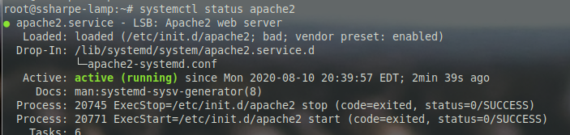
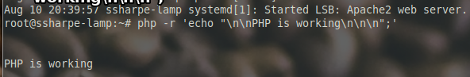
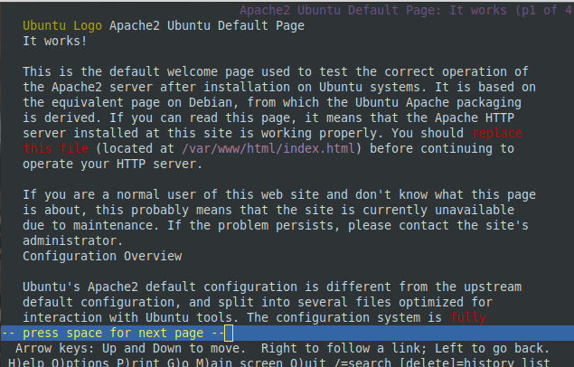

# Preparing LAMP

LAMP stands for Linux Apache MySQL and PHP.  We will start by installing Apache and MySQL

**apt-get install apache2 mysql-server**

When you install mysql-server, you will need to set a root password… DO NOT LOSE THIS! Use your_username for consistency.

Next we will install PHP

**apt-get install php libapache2-mod-php php-cli**

Next we will enable apache

**systemctl enable apache2**

Restart apache

**systemctl restart apache2**

Check the status

**systemctl status apache2**

Test that PHP is working

php -r 'echo "\n\nPHP is working\n\n\n";'

Install `lynx` to confirm connectivity to the Apache server from the headless server.

`apt-get install lynx`

**lynx localhost**

The lynx localhost should bring up the apache default web page in text mode. Use q to quit lynx.

## **Screenshot 1: Default Apache page in Lynx**

Try some of the following commands and note their differences and consider applicable uses for all three and consider the potential uses within the security field.

**wget localhost** (look for a new file created called index.html)

Next try curl (don't forget to read the man page as well!)

**apt-get install curl**

**curl localhost**

[Prev](02_house-keeping.md) | [Home](README.md) | [Next](04_certificate-work.md)
