O# Certificate Work

## Certificate Authority prep

Before we begin, we will introduce a few key terms that appear throughout this lab.

- `x509` is a certificate and commonly uses the `crt`, `cer`, or `pem` extension.
- `req` is a certificate request and commonly uses the `csr` extension.
- `rsa` is a private key and commonly uses the `key` or `pem` extension.

Extensions are only suggestive. Always inspect headers/footers with `cat`, check file type with `file`, and confirm contents with OpenSSL.

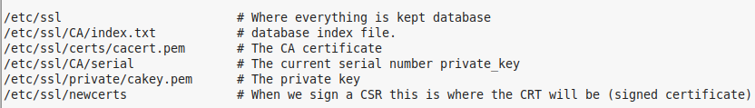

Normally, we would start with a root certificate authority, which would then sign certificates for subordinate certificate authorities. You would then take the root certificate offline to reduce risk.

For this lab, we use a single self-signed CA (no separate offline root + intermediate chain).

**For the remainder of this lab, you must be root.**

Create the directories to hold the CA certificate and related files:

```bash
mkdir /etc/ssl/CA
mkdir /etc/ssl/newcerts
```

The CA also needs files to track serial numbers and issued certificates:

```bash
echo 01 > /etc/ssl/CA/serial
touch /etc/ssl/CA/index.txt
```

Back up the CA configuration file in case we need to revert:

```bash
cp /etc/ssl/openssl.cnf /etc/ssl/openssl.cnf.original
```

We now need to tell OpenSSL where to find the files it needs when acting as a certificate authority.

Edit `/etc/ssl/openssl.cnf`:

```bash
vi /etc/ssl/openssl.cnf
```

In the `[ CA_default ]` section, change:

```ini
dir = /etc/ssl # Where everything is kept
database = $dir/CA/index.txt # database index file.
certificate = $dir/certs/cacert.pem # The CA certificate
serial = $dir/CA/serial # The current serial number
private_key = $dir/private/cakey.pem # The private key
```

Make sure there is a space on both sides of `#` in inline comments.

Video reference: https://www.youtube.com/watch?v=st6tee86zXQ

Next, create the self-signed root certificate in root's home directory:

```bash
openssl req -new -x509 -extensions v3_ca -keyout cakey.pem -out cacert.pem -days 365
```

You will then be asked to enter certificate details.

Passphrase cannot be left blank. Enter `your_username` for the PEM password and verify.

- Country: CA
- State or Province: Ontario
- Locality Name: London
- Organization Name: your_username
- Organizational Unit Name: your_username.local
- Common Name: your_username-ca.your_username.local
- Email Address: your_username@your_username.local

`CA` is the internet country code for Canada. Replace all placeholders with your own values.

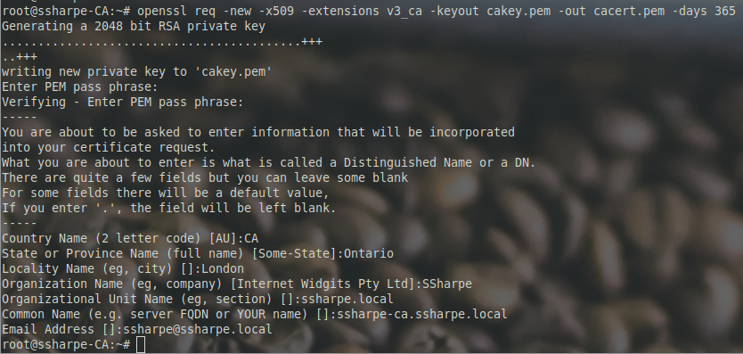

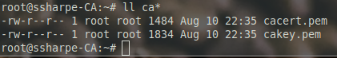

This creates two files.

Certificate files, private keys, and CSRs usually include recognizable headers and footers.

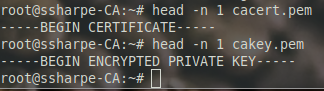

Sometimes the `file` utility (based on [magic numbers](https://en.wikipedia.org/wiki/Magic_number_(programming))) is wrong or inconclusive, so verify thoroughly.

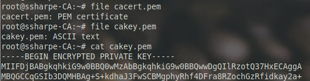

You can inspect certificate-related files with OpenSSL:

```bash
openssl [TYPE] -text -noout -in FILE
```

Common types are `x509`, `rsa`, and `req`.

```bash
openssl x509 -text -noout -in cacert.pem | less
openssl rsa -text -noout -in cakey.pem | less
```

Note: the private key is protected by your passphrase.

Now install the root certificate and key:

```bash
mv cakey.pem /etc/ssl/private/
mv cacert.pem /etc/ssl/certs/
```

## **Screenshot 2: show your cacert.pem in /etc/ssl/certs**

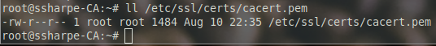

## Creating a certificate signing request

**Create a CSR on your LAMP server (`your_username-LAMP`)**

First, create a configuration file named `csrdetails` in root's home directory with the following content:

```ini
[req]
default_bits=2048
prompt=no
default_md=sha256
req_extensions=req_ext
distinguished_name=dn

[dn]
C=CA
ST=Ontario
L=London
O=your_username
OU=your_username.local
emailAddress=your_username@your_username.local
CN=www.your_username.local

[req_ext]
subjectAltName=@alt_names

[alt_names]
DNS.1=your_username-apache.your_username.local
```

Create the certificate using:

```bash
openssl req -new -sha256 -nodes -out www.your_username-ca.local.csr -newkey rsa:2048 -keyout www.your_username.local-apache.key -config <(cat csrdetails)
```


Two files will have been created


Verify the files are as you would expect


Since this is a certificate **request**, use type `req`:

```bash
openssl req -text -noout -in www.your_username-ca.local.csr | less
```

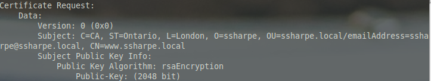

Move the private key to the SSL store:

```bash
mv ~/www.your_username.local-apache.key /etc/ssl/private/your_username-apache.your_username.local.key
```
## **Screenshot 3: print the details of csrdetails**


The CSR contains the public key and distinguished name for `your_username-LAMP` and is now ready to be signed by the certificate authority.

You can now submit this CSR file to a CA for processing. The CA will use this CSR and issue a certificate.

You could use PuTTY to copy/paste, but this example assumes host files are configured and SSH keys are exchanged. We will use `scp`.

Currently, the CSR is stored in root's home directory, and root SSH login is denied by default. We only need read access, so copy the CSR to `/tmp`.

On the LAMP server:

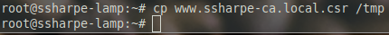

The CSR must be located at `/etc/ssl/certs/www.your_username-ca.local.csr` on `your_username-CA`.

```bash
cd /etc/ssl/certs/
scp your_username@your_username-lamp:/tmp/www.your_username-ca.local.csr www.your_username-ca.local.csr
```

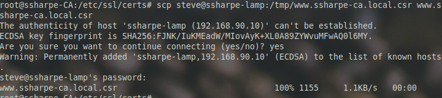

**Question**: Why we had this error?

File should now be in the right location.

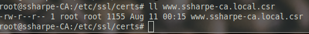

---
### Knowledge Check

> **Q1.** Why did secure copy not use the keypair?
> - [ ] **A.** When we setup the key pair we used a regular account, not root.
> - [ ] **B.** root is forbidden to use SSH.
> - [ ] **C.** No permission to read SSH keys.
> - [ ] **D.** We only installed the keypairs in one direction.

<details>
<summary>👉 <b>Check your answer</b></summary>

**Correct Option: A**

When we setup the key pair we used a regular account, not root.
</details>
---

## **Screenshot 4: CSR contents on the correct server in /etc/ssl/certs**

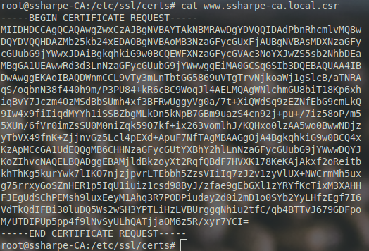

## Certificate Signing

Once you have the CSR on the CA server, sign it:

```bash
openssl ca -in www.your_username-ca.local.csr -config /etc/ssl/openssl.cnf
```

## **Screenshot 5: command and output**

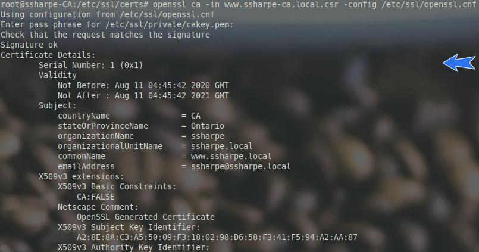

Say yes to signing and committing the new certificate.

There should now be a new file, `/etc/ssl/newcerts/01.pem`, containing the certificate output. Subsequent certificates will be named `02.pem`, `03.pem`, and so on.

The two CA tracking files we created earlier are also updated.


In the third column, you can see this certificate was assigned serial number `1`.

This database recognises duplicate certificate requests. Try it and observe the error.

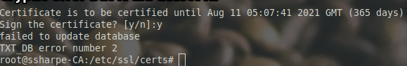

This file must now be copied to `your_username-LAMP` and saved as `/etc/ssl/certs/your_username-apache.your_username.local`.

We can use `scp` again on `your_username-LAMP`. Since `/etc` is globally readable, we do **not** need to copy the file to `/tmp` first.

```bash
cd /etc/ssl/certs/
scp your_username@your_username-ca:/etc/ssl/newcerts/01.pem your_username-apache.your_username.local
```

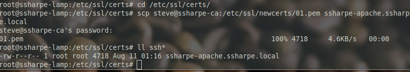

[Prev](03_preparing-lamp.md) | [Home](README.md) | [Next](05_configure-apache-to-use-signed-certificates.md)
