# Configure Apache to use signed certificates

We will be configuring Apache site files in `/etc/apache2/sites-available`.

Create an SSL site by copying `000-default.conf` to `000-default-ssl.conf`:

```bash
cp 000-default.conf 000-default-ssl.conf
```

Open `000-default-ssl.conf` in `vi`.

In the first line, change port `80` to `443`.

After `DocumentRoot`, add:

```apache
SSLEngine on
SSLCertificateFile /etc/ssl/certs/your_username-apache.your_username.local
SSLCertificateKeyFile /etc/ssl/private/your_username-apache.your_username.local.key
```

## **Screenshot 6: Show changes to 000-default-ssl.conf**

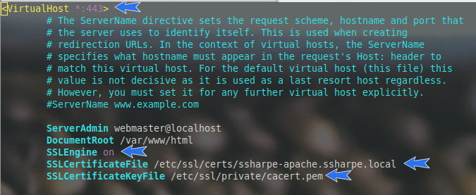

Edit the Apache config file:

`/etc/apache2/apache2.conf`

Search for `Global configuration` and add:

```apache
ServerName localhost
```

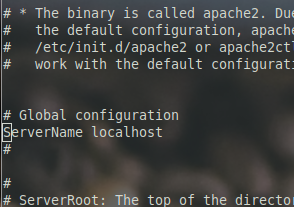

Enable the new SSL site:

```bash
a2ensite 000-default-ssl.conf
```

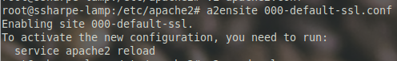

**a2enmod ssl**
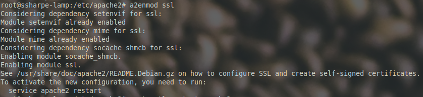

Restart Apache:

```bash
systemctl restart apache2
```

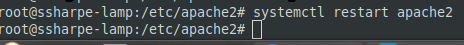

Double-check Apache status:

```bash
systemctl status apache2
```

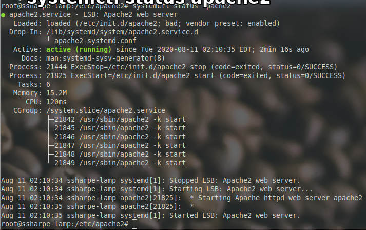

You should now be able to browse to the HTTPS version of your default Apache page on your LAMP server, but there is still a certificate error in Windows.

## **Screenshot 7: Firefox with the certificate error going to the default page.**

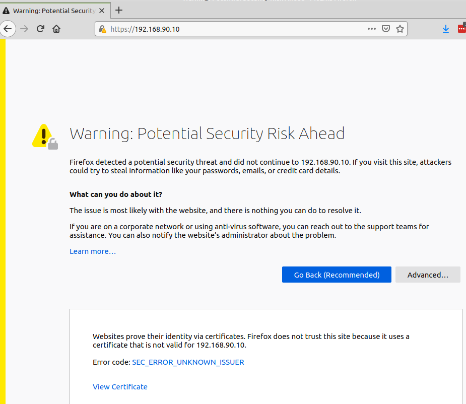

Windows needs to trust the certificate authority. The certificate file is `/etc/ssl/certs/cacert.pem` on `your_username-CA`.

There are multiple ways to transfer the file, but we will use [FileZilla](https://filezilla-project.org/). Select `SFTP - SSH File Transfer Protocol`.
![[Pasted image 20260304105309.png]]

Accept the server fingerprint.

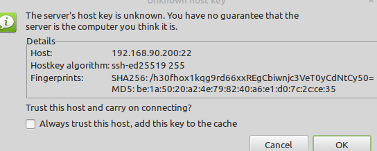

Remote server is on the right, your local system is on the left. In this example, the file is copied to the desktop. Double-click the file in the bottom-right panel to begin transfer.

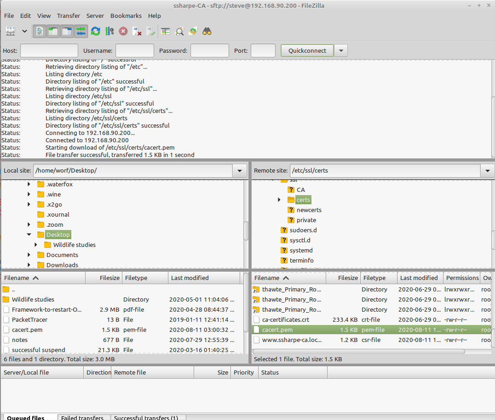

Step 1:


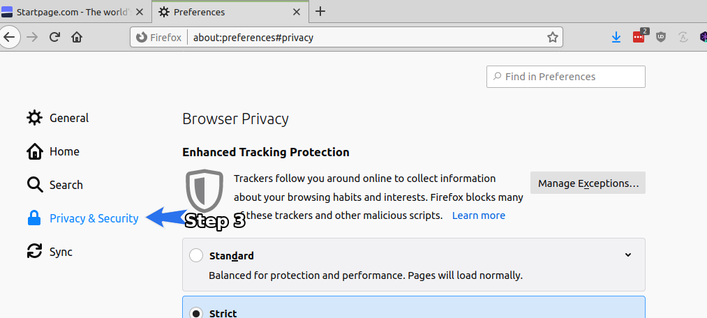

Scroll to the bottom and select **View Certificates**.

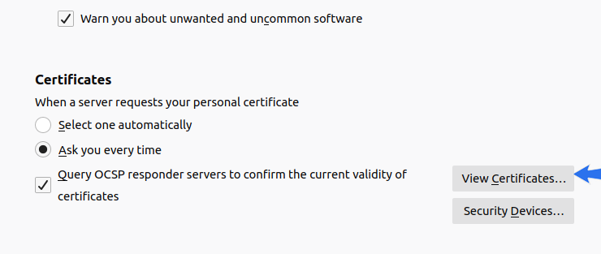


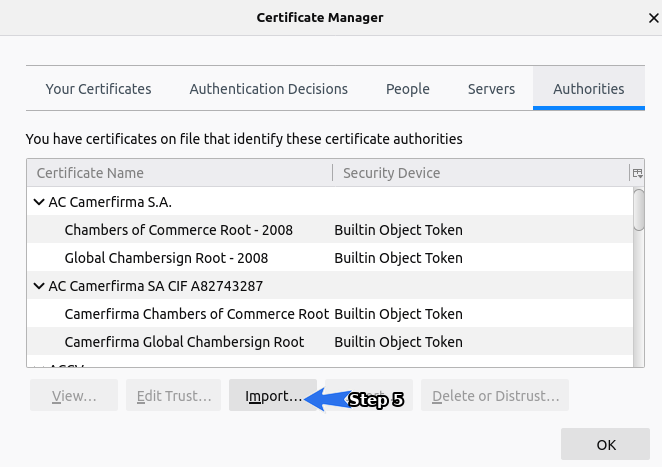

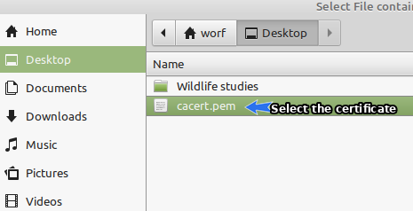

Select both trust options.

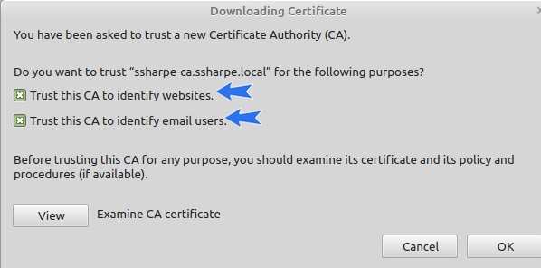


## **Screenshot 8: authorities showing your imported certificate**


**Put an entry in the hosts file**

Because certificates prove domain ownership, we need to map `your_username-LAMP` to an IP address. We do not need a full DNS infrastructure for this lab; use the Windows hosts file.

Open `c:/windows/system32/drivers/etc/hosts` with Notepad **as Administrator**.

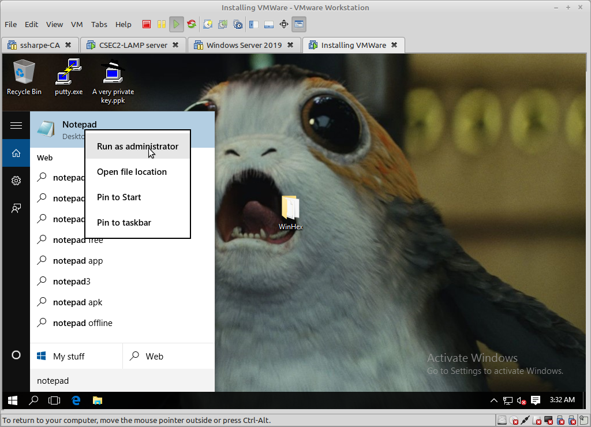

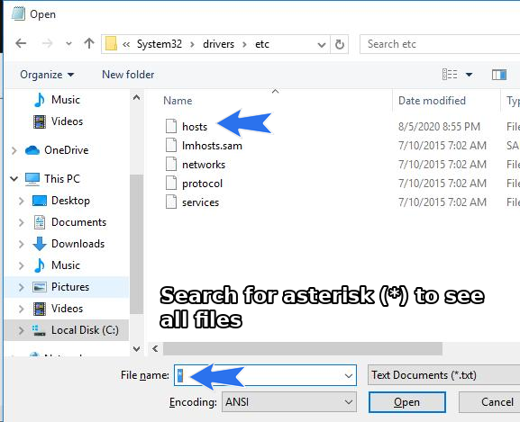

Add these two entries:

```text
192.168.90.10 www.your_username.local
192.168.90.10 your_username.local
```

## **Screenshot 9: show the contents of c:/windows/system32/drivers/etc/hosts**

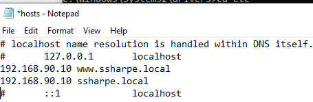

## **Screenshot 10: Firefox with a closed padlock and no errors**

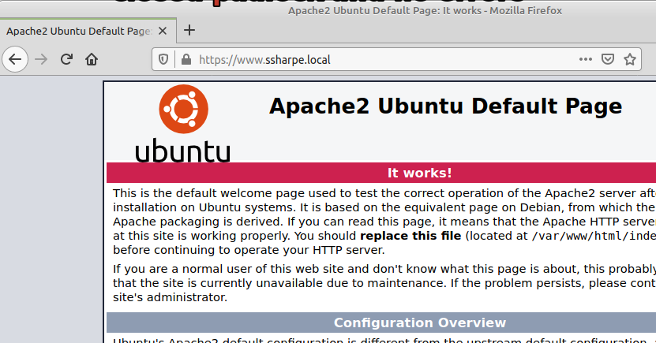


Try without the www and the certificate error returns because the common name was only for www.your-name.local and not a wildcard such as *.your-name.local.
![[Pasted image 20260304105735.png]]

https://www.youtube.com/watch?v=Pzv_7Bx1C-Y

[Prev](04_certificate-work.md) | [Home](README.md) | [Next](06_troubleshooting-openssl.md)
