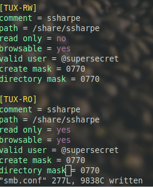
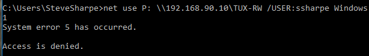
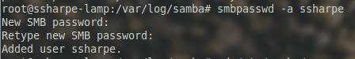
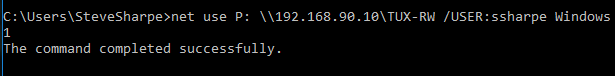
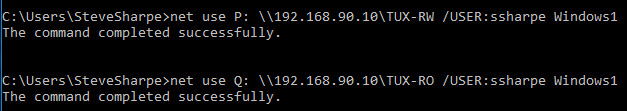
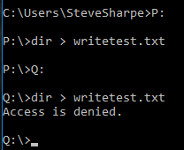

# samba

*A file and printer sharing daemon that is fully Active Directory aware!*

Start by installing samba using apt-get (package name is samba)

We need a base directory for our shares plus a subdirectory your_username. Create one off of root **mkdir -p /share/your_username**
> **Note:** `your_username` is first initial + last name.

Create the group supersecret and add your_username to this group.  Add your_username to the sambashare group

addgroup supersecret

usermod -aG supersecret your_username

usermod -aG sambashare your_username

---

Make the following changes to /share

**Screenshot 4:** Showing the correct permissions on /share/your_username

### Knowledge Check

What command using octal sets your_username directory to drwxrwx---?

Answer

`chmod 770 your_username`

### Knowledge Check

What command changes your_username group ownership to supersecret?

Answer

`chgrp supersecret your_username`

---

Open /etc/samba/smb.conf and review some of the available settings.

At the bottom of the file, create a new share named [TUX-RW] with the following values:

comment = your_username  

path = /share/your_username  

read only = no  

browsable = yes  

valid users = @supersecret  

create mask = 0770  

directory mask = 0770

Duplicate this share information but name it TUX-RO (*You do not need to create a new subfolder,  

just set the share name as indicated and the set the “read only” flag to yes*)

After make sure to restart the samba service: **service smbd restart**

---

**Screenshot 5:** your two shares created from smb.conf

---

Next try to connect. We will first try to map TUX-RW to the P drive.

Set a password now for your_username that Samba can use.

SUCCESS!

---

**Screenshot 6:** Show the two connected shares

Map P to TUX-RW

Map Q to TUX-RO

---

**Screenshot 7:** Using the follow methods show that the shares have different write permissions.

[Prev: vsftpd](01_vsftpd.md) | [Home](README.md)
