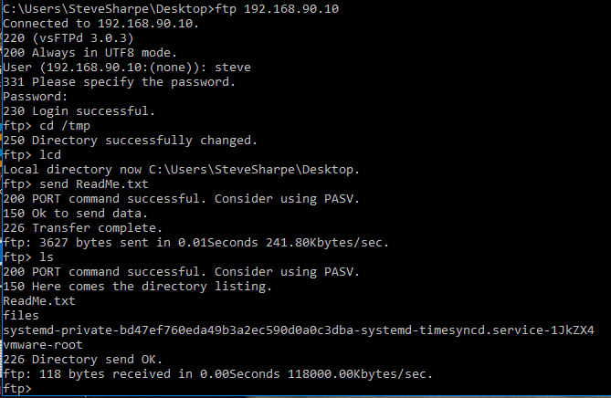
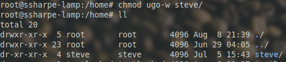
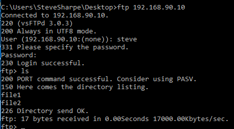
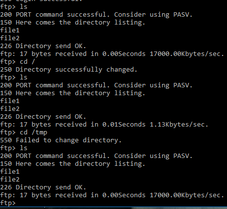
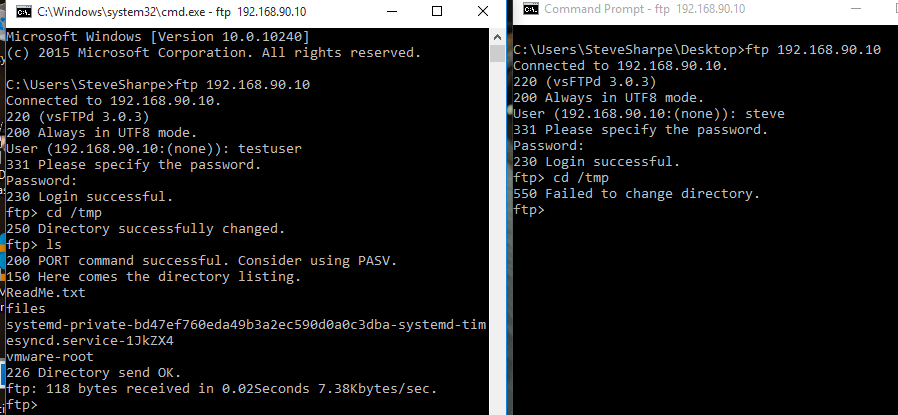
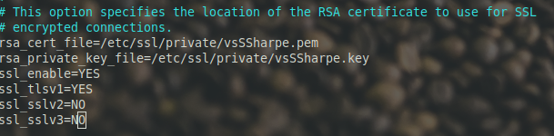
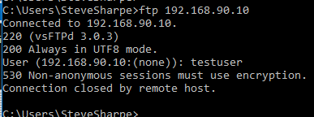
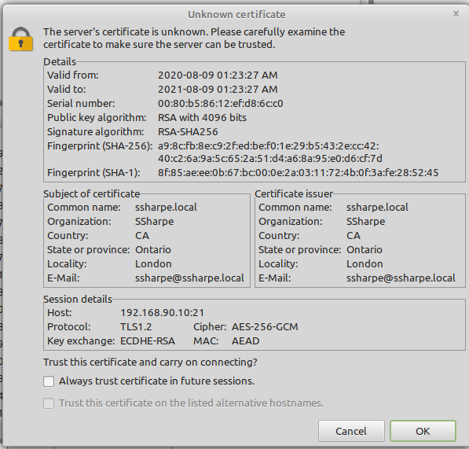

# vsftpd

Configuring vsftp

*Very Secure FTP daemon*

NOTE: Make sure to clear your screen for every screenshot

Install the package using apt-get, the package name is vsftpd then enable it on system startup with **systemctl enable vsftpd.**

Before getting started make sure to backup the configuration in case you need to revert back

cp /etc/vsftpd.conf /etc/vsftpd.conf.original

**Screenshot 1:** Directory listing show the backup file including the date created

---

Open the vsftpd.conf and uncomment the line that reads "write\_enable=YES".  Save and restart the vsftpd daemon.

Restart the vsftpd service with **systemctl restart vsftpd** then verify ftp works from your host to the VM.

---

Using your FTP client of choice verify that this **regular user** has the ability to traverse, read and write files throughout the filesystem.  In this example I uploaded ReadMe.txt sitting on my Desktop.

---

Open the vsftpd.conf file

Reconnect

---

What it is telling us, as a warning that we've enabled chroot which is something we would enable for a highly restrictive user that this particular account has *write access to their home directory*.

write removed

---

Success!

---

Try to leave your home directory.

---

Effectively what we've done is a common UNIX technique known as the [root jail](https://en.wikipedia.org/wiki/Chroot)

There may be paying customers that should be able to write to their home directories, therefore you can add the allow\_writeable\_chroot=YES directive which will enforce both the root jail but also allow the user to add files to their home directory.

---

Using the adduser script create a user named testuser.  Create the file /etc/vsftpd.chroot\_list and add testuser to this file.

Once completed restart the ftp service.

---

**Screenshot 2:** Show both connections (steve user, testuser) and their different access abilities.

What happens? Why does this occur?

---

**Enabling TLS for FTP**  

Create a new RSA key using openSSL

**openssl req -x509 -nodes -keyout /etc/ssl/private/vsSSharpe.key -out /etc/ssl/private/vsSSharpe.pem -days 365 -newkey rsa:4096**

**Screenshot 2:** Key Generation and Entered Information

---

Make the following changes to vsftpd.conf

Non-encrypted connections forbidden.

---

Download [Filezilla](https://filezilla-project.org)

---

**Screenshot 3:** Certificate as displayed by FileZilla

---

So I see there is an FTP group but we didn't use it? True! We need to [enable it in PAM](https://serverfault.com/questions/931127/ftp-pam-setup-for-vsftpd) as a requirement

See Ubuntu's guide on vsftpd for more [configuration examples.](https://help.ubuntu.com/community/vsftpd)

[Home](README.md)
